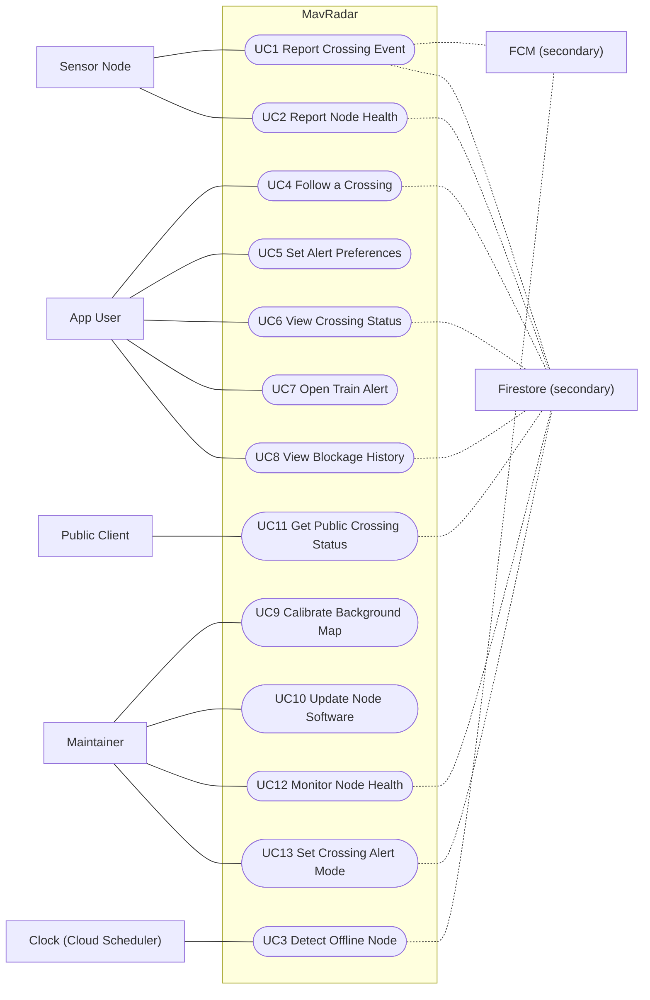

# 01 Use Cases

Phase 1 of the blueprint. Actors, the use case list, and the use case diagram. Requirement numbers are deliberately left out of this file: the traceability matrix in [00_README.md](00_README.md#traceability-matrix) is the one place they sit next to use case IDs, because SRS numbering may still shift before Oct 23.

## Actors

| Actor | Kind | Who or what | Starts |
| --- | --- | --- | --- |
| App User | Primary, human | A driver, student or commuter with the MavRadar app. No account; the app signs in anonymously. | UC4, UC5, UC6, UC7, UC8 |
| Sensor Node | Primary, system | The radar and Pi Zero 2 W in the field: at the crossing while there is one, spaced out on each side once there are two ([D4](00_README.md#decisions)). Starts the most important use cases. | UC1, UC2 |
| Maintainer | Primary, human | A team member who tunes, calibrates and services the node and runs the backend. | UC9, UC10, UC12, UC13 |
| Public Client | Primary, human or system | A web visitor on the public status page, or a third party calling the public status API. A city's own systems would most likely be one of these ([D3](00_README.md#decisions)). | UC11 |
| Clock | Time trigger | Fires when a node has missed its heartbeats. In practice a Cloud Scheduler job that calls the server once a minute ([D5](00_README.md#decisions)). Exists because offline detection is server-side as well as in the app ([OQ2](00_README.md#open-questions), settled). | UC3 |
| FCM | Secondary, system | Firebase Cloud Messaging, which delivers pushes to phones. Supports UC1 and UC3; never starts a use case. | |
| Firestore | Secondary, system | Stores crossing status, the blockage log, device registrations and node health. Supports most use cases; never starts one. | |

Changes from the handoff's starting list:

- **Added Public Client.** The public status page and API (from the architecture diagram, Firebase Hosting `GET /status`) have a user who isn't an App User.
- **Dropped City Staff for now.** The city dashboard is on the back burner, and what cities get may well be an open API instead of a dashboard ([D3](00_README.md#decisions)). If a city service comes back into scope, City Staff returns as an actor, most likely on UC8 and UC11.
- **Clock is kept.** [OQ2](00_README.md#open-questions) was settled as server-side and client-side offline detection both, so UC3 stays. Before that, if OQ2 had landed on client-side only, UC3 would have folded into UC6 and the Clock actor goes away.

## Use cases

Each use case is written in Kung's high-level form: it begins with an actor, ends with that actor, and completes a business task for that actor. TUCBW means "this use case begins with" and TUCEW means "this use case ends with".

Depth says how far each one goes in later phases. **Full** ones get an expanded use case (Phase 3), scenario tables (Phase 4) and sequence diagrams (Phase 5). **Brief** ones stop here.

| ID | Use case | Actor | Depth |
| --- | --- | --- | --- |
| UC1 | Report Crossing Event | Sensor Node | Full |
| UC2 | Report Node Health | Sensor Node | Full |
| UC3 | Detect Offline Node | Clock | Full, after OQ2 |
| UC4 | Follow a Crossing | App User | Full |
| UC5 | Set Alert Preferences | App User | Brief |
| UC6 | View Crossing Status | App User | Brief |
| UC7 | Open Train Alert | App User | Full |
| UC8 | View Blockage History | App User | Brief |
| UC9 | Calibrate Background Map | Maintainer | Full |
| UC10 | Update Node Software | Maintainer | Brief, later |
| UC11 | Get Public Crossing Status | Public Client | Brief (added) |
| UC12 | Monitor Node Health | Maintainer | Brief (added) |
| UC13 | Set Crossing Alert Mode | Maintainer | Brief (added) |

### UC1 Report Crossing Event

- **Actor:** Sensor Node
- **TUCBW** the node's detector changes state (a train is approaching, blocking, stopped, or the crossing has cleared) and the node sends the event to the ingest API.
- **TUCEW** the node receives the acknowledgement and removes the event from its local buffer.
- **Business task:** get a confirmed change in crossing state to everyone following that crossing, inside the gate warning window, and record it.
- **Postconditions:** followers are notified on `train-alerts` when the crossing's alert mode allows that kind of event (see UC13 and [D1](00_README.md#decisions)); the crossing document shows the new state; a finished blockage is added to the blockage log.
- **Notes:** "Receive Train Alert" is not a use case of its own. The user doesn't start it; the alert is a postcondition of UC1, and the user's own action is UC7. Whether the node sends state changes or raw detections is [OQ1](00_README.md#open-questions).

### UC2 Report Node Health

- **Actor:** Sensor Node
- **TUCBW** the node's heartbeat interval elapses and the node sends a health report (battery voltage, enclosure temperature, uptime, signal).
- **TUCEW** the node receives the acknowledgement.
- **Business task:** prove the node is alive and healthy, so a quiet crossing is never confused with a dead sensor.
- **Postconditions:** the node's last-seen time and health values are updated, and the crossing's freshness reflects it. How often, and where that freshness is written, is [OQ7](00_README.md#open-questions).

### UC3 Detect Offline Node

- **Actor:** Clock
- **TUCBW** the clock fires and the system finds a node whose last heartbeat is older than the offline threshold.
- **TUCEW** the crossing is marked Unknown and followers have one "status unknown" note on `service-status`.
- **Business task:** make sure nobody trusts a crossing status that no live sensor stands behind.
- **Notes:** this only exists if offline detection is server-side ([OQ2](00_README.md#open-questions)). The app already applies a client-side freshness rule (Live, Delayed, Unknown), so UC6 is safe either way. What UC3 adds is the push to followers and the dashboard flag. Kung's rule that a use case ends with its actor fits a time trigger loosely; that is part of why OQ2 matters.

### UC4 Follow a Crossing

- **Actor:** App User
- **TUCBW** the user taps Follow on a crossing (map sheet, list star, the alerts switch on Status, or an alert switch in Settings).
- **TUCEW** the user sees the crossing marked as followed, with alerts on or a clear explanation of why they are off.
- **Business task:** subscribe this phone to alerts for a crossing, with no account.
- **Notes:** includes the in-app priming sheet and the system permission prompt the first time, and device registration through the single `registerDevice()` entry point. Unfollow is the same use case in reverse. Alternate flows that matter in Phase 3: permission denied, offline at registration time.

### UC5 Set Alert Preferences

- **Actor:** App User
- **TUCBW** the user opens Settings and changes an alert preference: which alert types to get, the minimum blockage time, commute windows, quiet hours, or "mute today".
- **TUCEW** the user sees the new setting in place.
- **Business task:** get only the alerts that matter to this person.
- **Notes:** renamed from the handoff's "Set Quiet Hours", because the app already has five preferences and the SRS requirement is about notification preferences in general. Which of these the server needs to know is [OQ9](00_README.md#open-questions): today they never leave the phone.

### UC6 View Crossing Status

- **Actor:** App User
- **TUCBW** the user opens the app or switches to a crossing.
- **TUCEW** the user sees the crossing's current state, how fresh it is, and the travel-information disclaimer.
- **Business task:** decide whether to take the crossing or the detour.
- **Notes:** brief, because the app's Status screen and the HTML mockup in `docs/design/` already cover it. The trust rule lives here: the app never shows Clear on stale data.

### UC7 Open Train Alert

- **Actor:** App User
- **TUCBW** the user taps a MavRadar notification.
- **TUCEW** the user sees the Status screen for that crossing, with live state and the detour.
- **Business task:** act on an alert in one tap.
- **Notes:** full, because the deep link has to work from a cold start, land on the right crossing, and never show a stale state as current. The tap handler (`onAlertTapped`) already exists in the app.

### UC8 View Blockage History

- **Actor:** App User
- **TUCBW** the user opens History for a crossing.
- **TUCEW** the user sees blockages over the last 7 or 30 days: count, typical and longest duration, and busiest hours.
- **Business task:** plan around a crossing's patterns.
- **Notes:** the app's History screen runs on fixed demo numbers today. Where real history comes from is [OQ11](00_README.md#open-questions).

### UC9 Calibrate Background Map

- **Actor:** Maintainer
- **TUCBW** the maintainer puts the node into calibration mode with the track known to be empty.
- **TUCEW** the maintainer sees the saved background map and a summary of what it will ignore.
- **Business task:** teach the node what the empty scene looks like (gate arms, masts, buildings), so it can tell a stopped train from fixed objects.
- **Notes:** edge-only. Full, because stopped-train detection depends on it entirely.

### UC10 Update Node Software

- **Actor:** Maintainer
- **TUCBW** the maintainer publishes a new node software version.
- **TUCEW** the maintainer sees the node running the new version, or a rollback report.
- **Business task:** change node software without a site visit.
- **Notes:** brief and later. The likely path is SSH over Tailscale (architecture diagram), which is mostly process, not product.

### UC11 Get Public Crossing Status (added)

- **Actor:** Public Client
- **TUCBW** a web visitor opens the public status page, or a client calls the public status endpoint.
- **TUCEW** the client receives the current state of the crossing.
- **Business task:** let anyone check a crossing without installing the app.
- **Notes:** the architecture diagram serves this from a cached Firebase Hosting response, so web visitors cause no database reads.

### UC12 Monitor Node Health (added)

- **Actor:** Maintainer
- **TUCBW** the maintainer opens the node health view.
- **TUCEW** the maintainer sees each node's battery voltage, enclosure temperature, uptime and last-seen time, with anything out of range flagged.
- **Business task:** spot a failing node days before it goes dark.
- **Notes:** UC2 is the node sending the data; this is the person reading it. Added because the remote health monitoring requirement has a human goal that UC2 alone doesn't cover.

### UC13 Set Crossing Alert Mode (added)

- **Actor:** Maintainer
- **TUCBW** the maintainer changes which alerts a crossing's node may send: log-only, blocked and cleared, or all types including approaching.
- **TUCEW** the maintainer sees the crossing's new alert mode in effect.
- **Business task:** turn on public alerts in stages, as detection accuracy is proven.
- **Notes:** added to carry decision [D1](00_README.md#decisions). Every node starts log-only; blocked and cleared alerts come first; approaching alerts are switched on only after the false-alarm rate has been measured. Where the mode lives (node config or server config) is a Phase 7 detail.

## Use case diagram

Mermaid has no use case diagram type, so this is a `flowchart LR`: actors are the rectangles on the left, use cases are the rounded shapes inside the MavRadar boundary, and the secondary systems sit on the right. Solid lines connect an actor to the use cases it starts; dotted lines go to the secondary systems a use case relies on. The diagram sticks to basic Mermaid syntax so it renders in any viewer.

Not drawn as use cases, on purpose:

- **Receive Train Alert.** A postcondition of UC1. The user's own action is UC7.
- **Register Device.** A step inside UC4, not a goal on its own.
- **Unfollow a Crossing** and **Mute Today.** Alternate flows of UC4 and UC5.
- **Install the node, distribute the app, publish the web page.** Hardware and process requirements; they appear in the matrix as "n/a".
