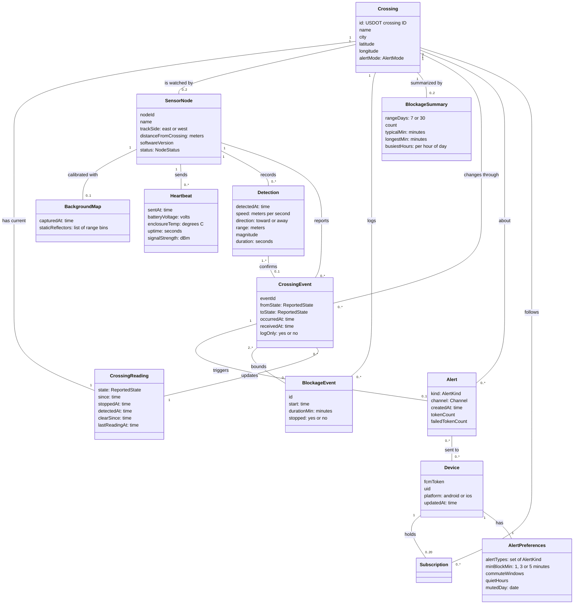
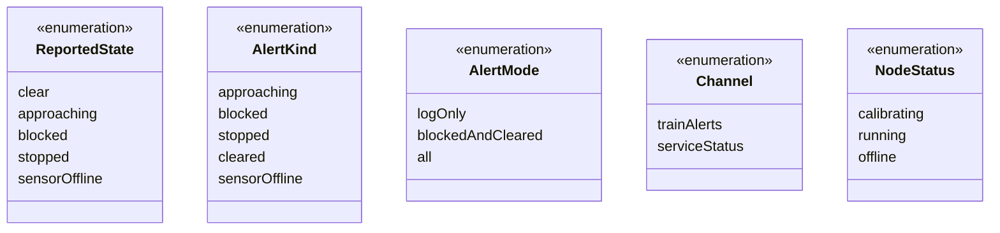

# 02 Domain Model

Phase 2 of the blueprint. The concepts MavRadar deals with, their attributes, and how they relate, with multiplicities. It is a conceptual model: no methods, no classes from any framework, and nothing about which file or service holds what. That comes in Phase 7.

Names already used in the app's `app/src/domain/types.ts` are kept as they are (`Crossing`, `CrossingReading`, `BlockageEvent`, `ReportedState`). Concepts the app doesn't have yet are new here and marked in the table at the end.

## Diagram

Attribute types are plain words (`time`, `meters`, `seconds`), not code types. Times are absolute timestamps. Enumerations are listed separately below. A link to another concept is drawn as an association, never repeated as an attribute, so Subscription has no attributes of its own: it is just the link between a Device and a Crossing.

## Enumerations

- **ReportedState** is exactly the app's type. What the app *displays* adds `unknown` and drops `sensorOffline`: that is the freshness rule's job, so it isn't a domain concept here. Phase 5 draws it as a state machine.
- **AlertKind** adds `approaching` to the app's four kinds, because of [D1](00_README.md#decisions). The app's `alerts.ts` doesn't have it yet.
- **AlertMode** carries D1 per crossing: log-only, then blocked/stopped/cleared, then all kinds. UC13 changes it.
- **Channel** maps one to one to the Android channel IDs `train-alerts` and `service-status`. `trainAlerts` is only ever used for approaching, blocked, stopped and cleared on a crossing whose AlertMode allows it.

## Concepts

| Concept | What it is | In the app today | Where it will live |
| --- | --- | --- | --- |
| **Crossing** | A grade crossing, identified by its USDOT ID. Location is the public FRA inventory point, never a node's location. | `Crossing` in `domain/types.ts`, plus `alertMode` (new) | `crossings/{usdotId}` |
| **CrossingReading** | The crossing's current state and freshness. Exactly one per crossing, overwritten as things change. | `CrossingReading`, which also carries `sensorName` and `sensorBatteryOk` (see OQ12 below) | Fields on `crossings/{usdotId}` |
| **SensorNode** (new) | One radar and Pi in the field: at the crossing while it is the only one, or down the track on one side once there are two (D4). Its exact location is never stored; only which side and roughly how far. | Only as `sensorName` text | `nodes/{nodeId}`, server-only |
| **BackgroundMap** (new) | What the empty scene looks like to the radar (gate arms, masts, buildings), so a stopped train stands out. Made in UC9. | No | On the node; a copy or summary on `nodes/{nodeId}` |
| **Heartbeat** (new) | A node's periodic "I'm alive" report with its health readings. Drives offline detection and remote monitoring. | Only its effect: `lastReadingAt` | Cloud Logging for the raw stream; the latest values on `nodes/{nodeId}` |
| **Detection** (new) | One radar track: something moving or present in the track's distance band. The raw material for deciding a train is there. | No | On the node (SQLite). Whether it is ever sent is OQ1. |
| **CrossingEvent** (new) | A change in a crossing's state, such as clear to approaching. What the node sends in UC1, under the `eventId` it generated. | No; the app sees only its result on `CrossingReading` | Ingest log, server-only |
| **BlockageEvent** | A finished blockage: start, duration, and whether the train stopped. The permanent history. | `BlockageEvent` | `crossings/{usdotId}/events/{id}` |
| **BlockageSummary** (new) | 7- and 30-day statistics for a crossing, kept up to date by the server so the app reads one document instead of hundreds. Derived from BlockageEvents. | Fixed numbers in `data/demo-history.ts` | `crossings/{usdotId}/summary` (OQ11) |
| **Device** | One phone that can receive alerts. Keyed by its push token, not by the anonymous uid. Holds no personal data. | Written by `registerDevice()` | `devices/{fcmToken}` |
| **Subscription** | A device following a crossing. At most 20 per device. | `prefs.following`, and the `subscriptions` array on the device doc | `subscriptions` array on `devices/{fcmToken}` |
| **AlertPreferences** | Which alerts a person wants and when: alert types, minimum blockage, commute windows, quiet hours, mute today. Replaces the brief's narrower "QuietHours". | `Prefs` in `state/prefs.ts`, on the phone only | Phone today; partly on `devices/{fcmToken}` if OQ9 goes that way |
| **Alert** (new) | One notification decision for a crossing: what kind, on which channel, how many tokens it went to and how many failed. | Only as local notifications in the demo | Alert log, server-only |

## Answers this model proposes

Three open questions were tagged for Phase 2. The model took a position on each so the diagram could be drawn, and all three are now settled: OQ5 and OQ8 as recommended, OQ12 as decision D2.

- **OQ8, what "event" means: agreed.** Two concepts with two names. A **CrossingEvent** is a state change, what the node sends and what `eventId` identifies. A **BlockageEvent** is a finished blockage, what History shows. A BlockageEvent is bounded by at least two CrossingEvents: the one that started the blockage and the one that cleared it. `crossings/{usdotId}/events/` keeps holding BlockageEvents, as the app already expects; CrossingEvents go to a server-only log.
- **OQ12, one sensor or several per crossing: decided as [D2](00_README.md#decisions).** A crossing is watched by at most two SensorNodes, one per side of the track, and zero until a node is installed (only Center St has one; the other crossings on the map have none). Everything this semester is built and tested for exactly one; the second node is the funded future goal, and the model only makes sure adding it is additive. Node health lives on the node, not the crossing. The app's `CrossingReading.sensorName` and `sensorBatteryOk` become a summary the server derives from the crossing's nodes, which with one node is simply that node. No app change is needed.
- **OQ5, `stopped` vs `blocked`: agreed.** Kept as separate states. A stopped train usually means a long blockage, which is when a detour matters most; the app already shows it, and the alert rules send one follow-up for it. In the model, `stopped` is a ReportedState and a BlockageEvent records whether its train stopped.

## Things worth noticing

- **The model separates what the node knows from what the public sees.** Detections and the BackgroundMap never leave the field unless OQ1 says so. CrossingEvents go to the server. Only CrossingReading, BlockageEvent and BlockageSummary reach the app. That boundary is also the privacy boundary: nothing a phone reads says anything about a person.
- **`logOnly` is on the CrossingEvent, not only on the crossing.** During log-only weeks the node still sends events, so the server records them and the team can compare against ground truth. They just never trigger an Alert. That is how the false-alarm rate gets measured for D1.
- **An Alert has at most one CrossingEvent behind it, and some have none.** A `sensorOffline` note comes from offline detection, not from a node event (UC3, OQ2).
- **No Tenant, ApiClient or CityAccount.** Amendment 003 lists them, but the city service is on the back burner ([D3](00_README.md#decisions)). If it comes back as an open API, an ApiClient concept attaches to UC11 without disturbing anything here.
- **No location for nodes or devices.** A node has a track side and a rough distance, never coordinates (a hard rule). A device has no location at all; geofenced subscriptions, if they ever come, stay on the phone (Amendment 002, section 5).
