# 05 Sequence Diagrams

Phase 5 of the blueprint. One Mermaid sequence diagram per scenario in [04_scenario_tables.md](04_scenario_tables.md), with the failure paths from [03_expanded_use_cases.md](03_expanded_use_cases.md) as `alt` and `opt` blocks. SD1 is S1, SD2 is S2, and so on. SD2b is the one extra: the other answer to [OQ1](00_README.md#open-questions), drawn so the two can be compared.

Messages are numbered (`autonumber`), so later phases can point at them: a method in the design class diagram (Phase 7) traces to "SD2 message 6", and a pattern card (Phase 6) names the messages that motivate it. Message names read like calls (`verify(nodeKey)`), but they are not final signatures; Phase 7 settles those.

The diagrams stick to basic Mermaid (`participant`, `alt`, `opt`, `loop`, `Note`) so they render in GitHub and older viewers.

**Background work runs as requests ([D5](00_README.md#decisions)).** The server runs on Cloud Run with request-based billing, which gives it no CPU between requests. So nothing in these diagrams runs "in the background": the blockage checks arrive from Cloud Tasks (SD4), the offline check and the follower sync arrive from Cloud Scheduler (SD6, SD8), and every Firestore write finishes before the server responds (SD3, SD5).

| Diagram | Scenario | Use case |
| --- | --- | --- |
| [SD1](#sd1-node-detects-and-sends-an-event) | Node detects and sends an event | UC1 |
| [SD2](#sd2-server-handles-the-event-the-hot-path) | Server handles the event, the hot path | UC1 |
| [SD2b](#sd2b-the-alternative-for-oq1-the-server-derives-the-state) | The alternative for OQ1 | UC1 |
| [SD3](#sd3-server-writes-then-acknowledges) | Server writes, then acknowledges | UC1 |
| [SD4](#sd4-blocked-stopped-and-cleared-alerts-follow-the-blockage) | Alerts follow the blockage | UC1 |
| [SD5](#sd5-node-sends-a-heartbeat) | Node sends a heartbeat | UC2 |
| [SD6](#sd6-server-detects-a-silent-node) | Server detects a silent node | UC3 |
| [SD7](#sd7-app-registers-the-device) | App registers the device | UC4 |
| [SD8](#sd8-server-picks-up-the-follow) | Server picks up the follow (once a minute) | UC4 |
| [SD9](#sd9-app-opens-on-a-tapped-alert) | App opens on a tapped alert | UC7 |
| [SD10](#sd10-node-calibrates-its-background-map) | Node calibrates its background map | UC9 |

## What the UC1 diagrams have to show

UC1 is the most important flow in the system, so the brief named six things its diagrams must make visible. Here is where each one is.

| Must show | Where |
| --- | --- |
| The push to FCM before the Firestore write | SD2 messages 19 to 23 send the push; every Firestore write comes after it, in SD3 messages 1 to 9 |
| The in-memory crossing-to-token lookup, with no Firestore read on the hot path | SD2 messages 16 and 17 (SubscriptionMap) |
| `eventId` dedupe | SD2 messages 8 to 12 and 24, SD3 message 10 (EventLog's three states: new, pushed, done), and SD1 message 16, the retry that makes it necessary |
| Channel selection (`train-alerts` vs `service-status`) | SD2 message 18; SD6 message 12 for `service-status` |
| Pruning invalid tokens after the FCM response | SD2 message 23 reports them; SD3 messages 7 to 9 remove them |
| The node's SQLite buffer and the ack | SD1 messages 6 to 16; SD3 message 11 is the ack, sent only after the writes |

---

## SD1: Node detects and sends an event

Detection and sending run separately on the node, so a slow or missing uplink never delays detection. An event is in the buffer before the first send is attempted.

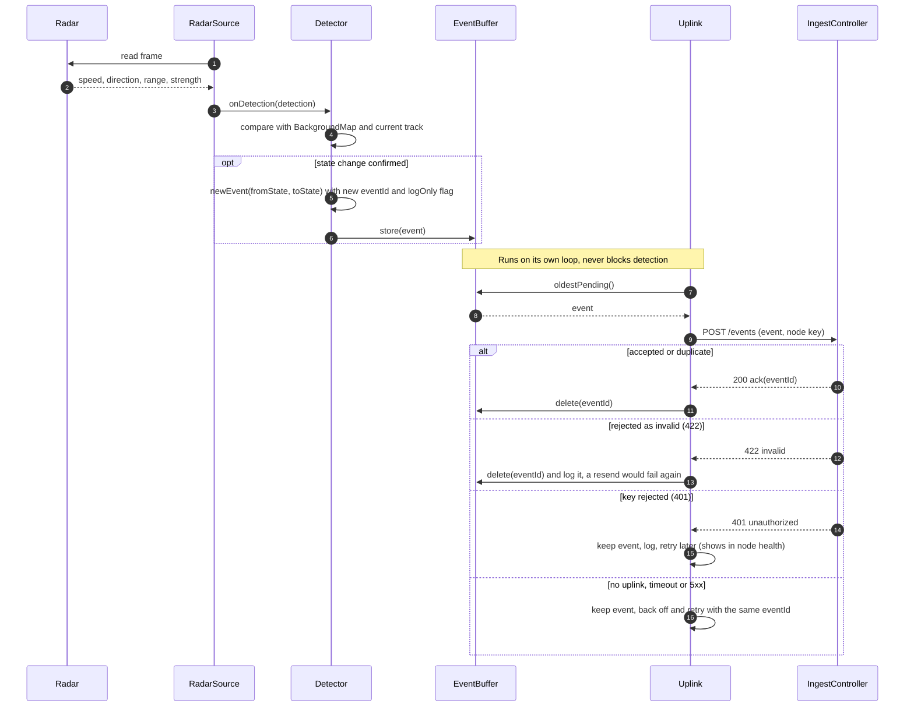

## SD2: Server handles the event, the hot path

Everything up to the push is in memory or goes to FCM. Nothing on this path reads from or writes to Firestore, so the database can never delay an alert. SD3 continues straight on in the same request: it writes to Firestore and only then acknowledges the node ([D5](00_README.md#decisions)).

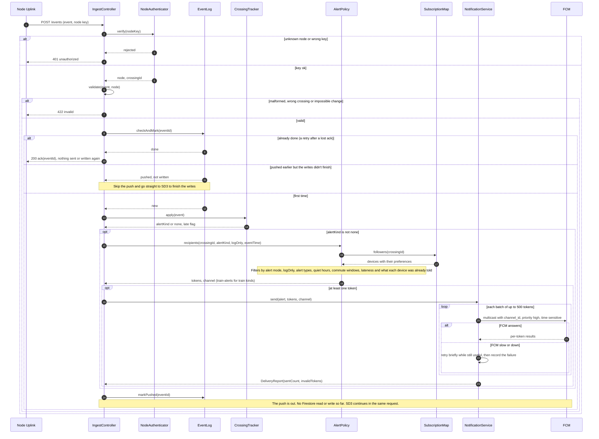

Notes:

- **Blocked doesn't alert here.** For a change to blocked, `AlertPolicy` returns no tokens at this point: blocked alerts go out from the confirmation checks in SD4, once each device's minimum blockage time has passed. Approaching, stopped and cleared alerts go out here.
- **Log-only and alert mode filter here, not earlier.** The event still updates the crossing's state and gets written in SD3. That is how log-only weeks produce the data for measuring false alarms (D1).
- **Lateness (OQ17)** comes from the event time: `CrossingTracker` flags the event late, and `AlertPolicy` drops alert kinds whose usefulness window has passed.

## SD2b: The alternative for OQ1, the server derives the state

[OQ1](00_README.md#open-questions) asks where the crossing state machine lives. SD2 draws the lean: the node runs it and sends state changes. This is the other option: the node streams raw detections and the server decides the state.

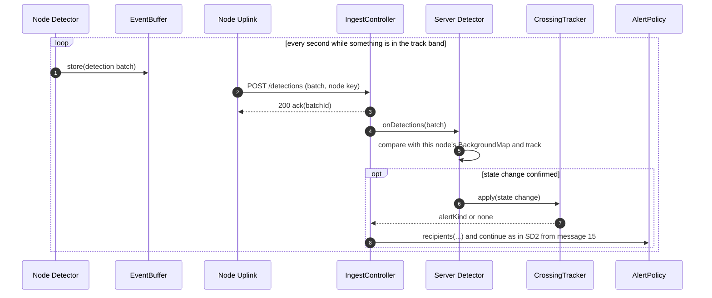

| | Node decides (SD2, the lean) | Server decides (SD2b) |
| --- | --- | --- |
| Latency | One request per state change. Nothing waits on the network to decide. | Every decision waits for the detections to arrive, so link delay and dropouts sit inside the warning budget. |
| Uplink traffic | A few small events per train. | A batch every second while something is in view. Matters on a metered Cat-M link. |
| Works through an outage | Yes. The node keeps deciding and buffers the events. | No. With the link down, nothing decides, and the replayed detections arrive too late to alert on. |
| Tuning detection | Needs a node software update (UC10). | Change the server and redeploy. Easier during log-only weeks. |
| Two nodes per crossing (future, D2) | Each node sends its own state; the server must merge two opinions about one crossing. | The server sees both nodes' detections and decides once. Cleaner for fusion. |
| Porting to an ESP32 later | The state machine has to stay portable (a stated goal). | The node only reads and forwards. |

Recommendation, unchanged: **the node decides.** It wins on latency and on working through outages, which matter most, and with one node (D2) there is nothing to merge. Two things keep the door open for later: the node records raw detections locally anyway (they're needed to measure accuracy during log-only weeks), and the server-side `CrossingTracker` is where merging two nodes would go.

## SD3: Server writes, then acknowledges

The second half of the same request as SD2. The push is already out; now the server writes everything to Firestore and only then acknowledges the node. With request-based billing, work after the response may never run ([D5](00_README.md#decisions)), so the acknowledgement waits for the writes. The node doesn't mind: nothing time-critical waits on its acknowledgement.

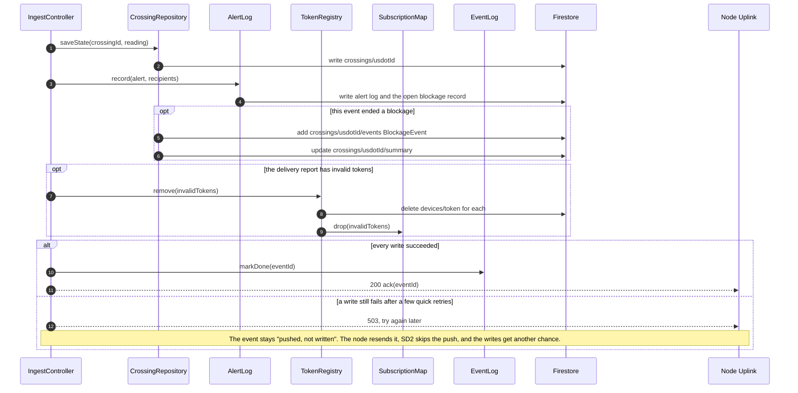

So a Firestore outage delays the database, never the alert, and never causes a second alert.

## SD4: Blocked, stopped and cleared alerts follow the blockage

A blockage needs memory across several events: when it started, which checks are still due, and who has been told what. This diagram covers UC1's alternate flows 5b to 5d. The 1, 3 and 5 minute checks are Cloud Tasks ([D5](00_README.md#decisions)): each one is a task that calls the server at its time, so they survive a server restart and need no CPU while waiting.

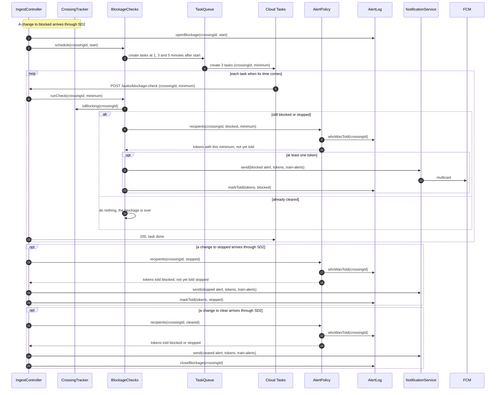

Notes:

- **No cancelling.** When the crossing clears, the remaining tasks still arrive, find the crossing no longer blocked, and do nothing. That costs a request or two and saves keeping track of task names.
- **`AlertLog` keeps open blockages in memory** and writes them to Firestore (SD3), so a restarted server reloads them at startup. Reading `whoWasTold` is a memory lookup, so the hot path still reads nothing from Firestore.
- **Only Cloud Tasks may call `/tasks/blockage-check`.** Each task carries a Google-signed identity token for a dedicated service account, and the endpoint rejects anything else.
- **Going sensor offline mid-blockage doesn't close it** (UC3 3a). The checks still arrive; `isBlocking` is false while the crossing is offline, so nothing is sent, and the node's state when it returns decides what happens next.

## SD5: Node sends a heartbeat

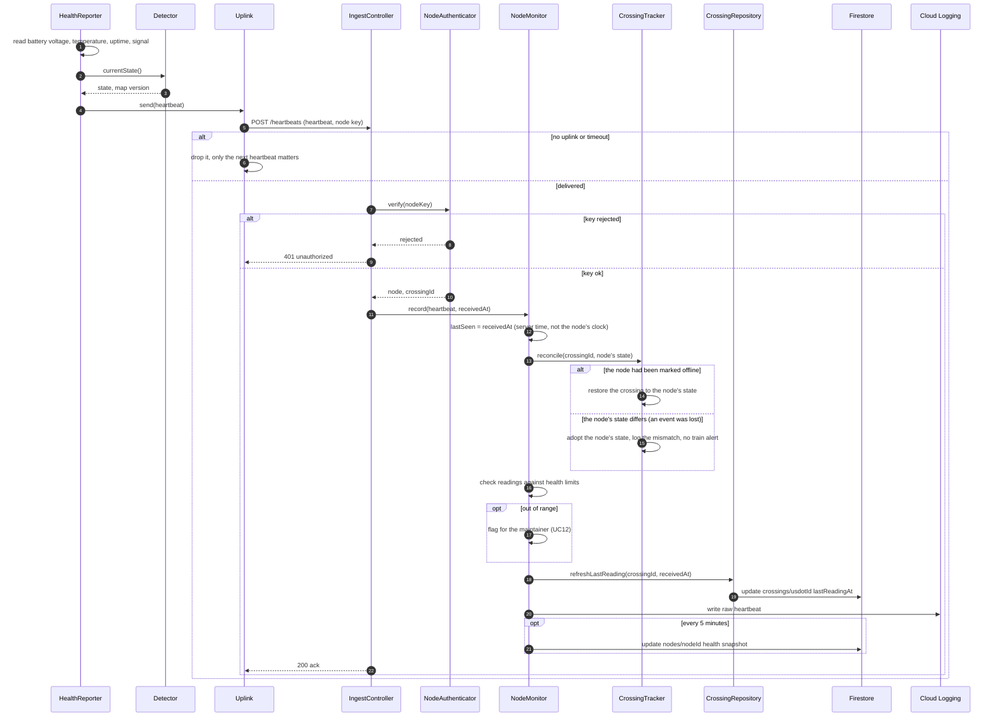

How often the heartbeat runs, and how often `lastReadingAt` reaches Firestore, is [OQ7](00_README.md#open-questions): a heartbeat every 30 seconds, each one refreshing `lastReadingAt`, with the full health snapshot written every 5 minutes and the raw stream in Cloud Logging. As in SD3, every write finishes before the acknowledgement (D5).

## SD6: Server detects a silent node

The check runs once a minute, as a request from Cloud Scheduler ([D5](00_README.md#decisions)).

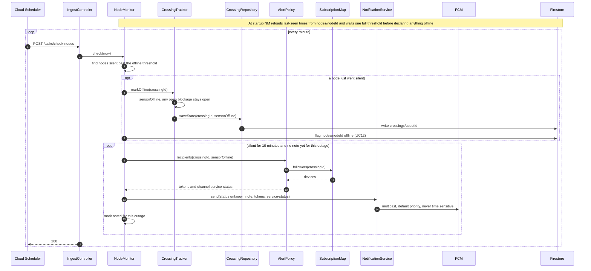

The note never goes on `train-alerts`, ignores alert types and quiet hours the same way the app's `shouldDeliver` does today, and goes out at most once per outage. With a 90-second threshold checked every minute, the server notices a dead node within about two and a half minutes. Phones don't wait for that: their own freshness rule shows Unknown at 90 seconds.

## SD7: App registers the device

This is the app as it is built today, plus the alert preferences that [OQ9](00_README.md#open-questions) adds to the device document.

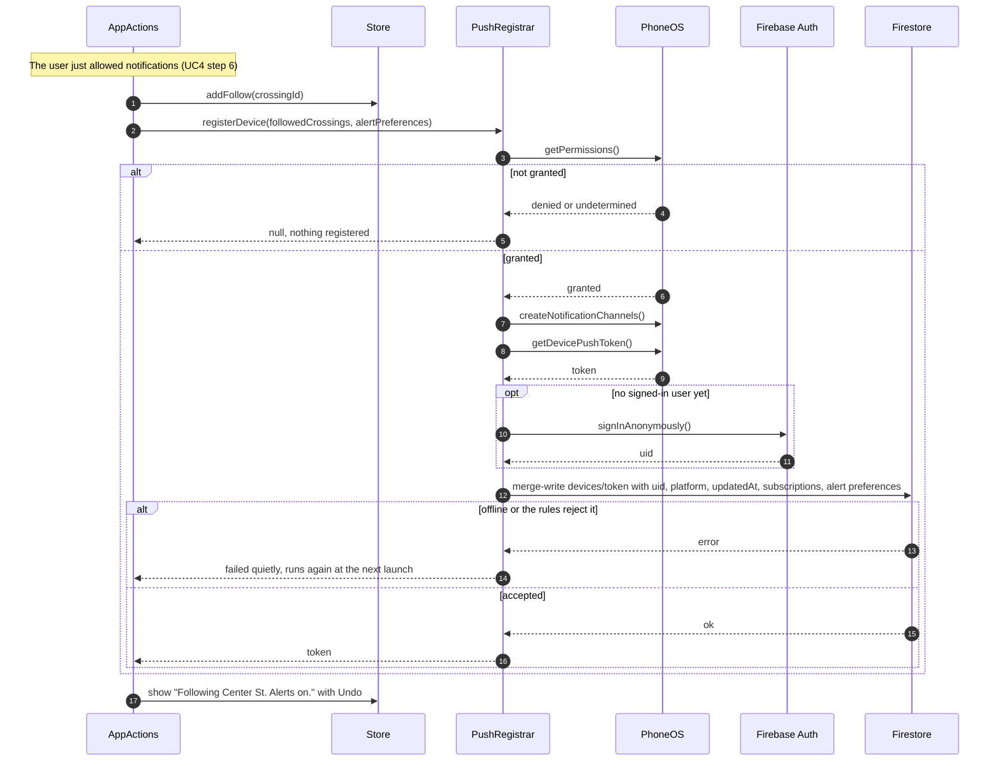

Two changes this implies for the app, recorded here and not made: `registerDevice()` sends `subscriptions` but not the alert preferences yet, and the Firestore rules' field allowlist has to grow to accept them (OQ9).

## SD8: Server picks up the follow

Once a minute, Cloud Scheduler asks the server to fetch only the device documents that changed since the last sync ([D5](00_README.md#decisions)). This replaces the always-open Firestore listener, which would need CPU between requests. The hot path still reads only from memory.

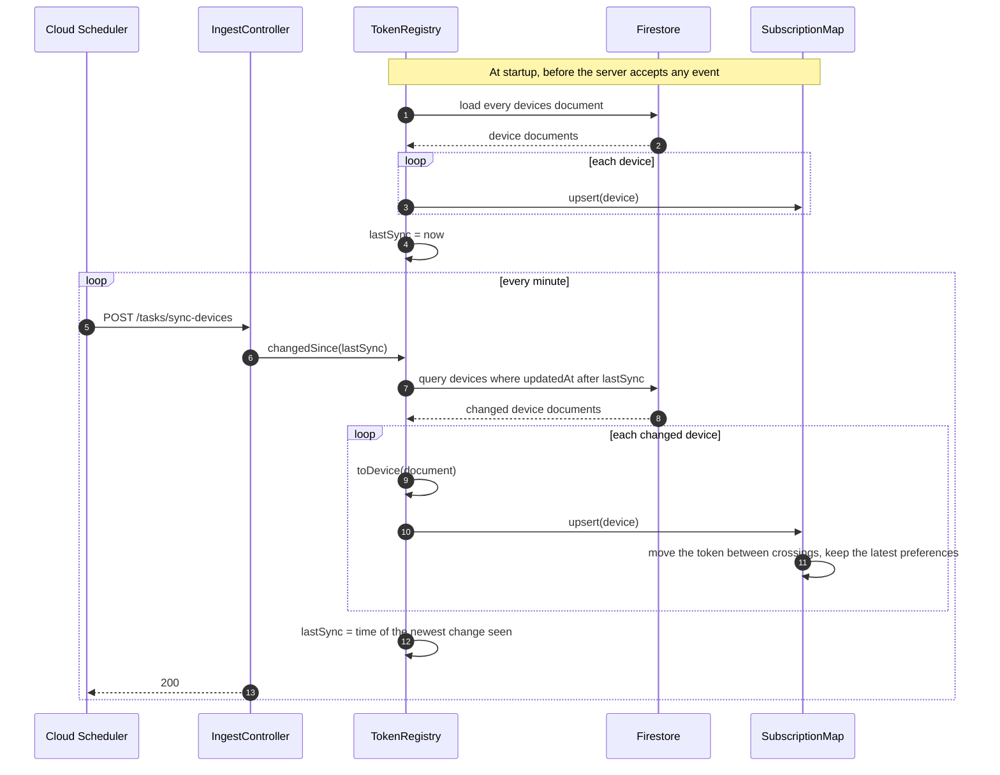

Notes:

- **A follow takes up to a minute to start getting pushes**, and an unfollow up to a minute to stop. That is the one trade-off of D5.
- **Every change bumps `updatedAt`.** The Firestore rules already require `updatedAt` to equal the write time, so an unfollow (fewer `subscriptions`) or a preference change is always caught. A device the server deleted itself (SD3) is already out of the map.
- **Cost:** one small query a minute, about 1,440 reads a day plus one per changed device. Well inside the free tier.

## SD9: App opens on a tapped alert

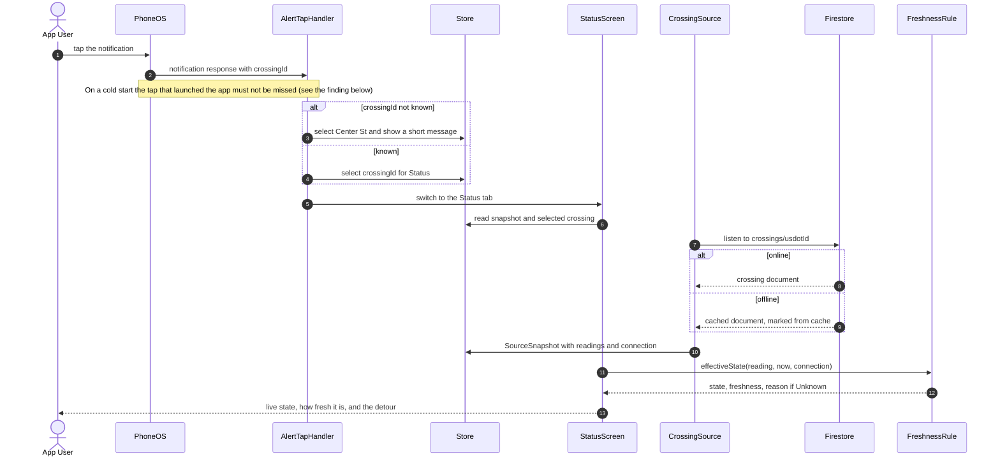

The notification's own text is never used as the state. Only the crossing document, passed through the freshness rule, decides what Status shows.

## SD10: Node calibrates its background map

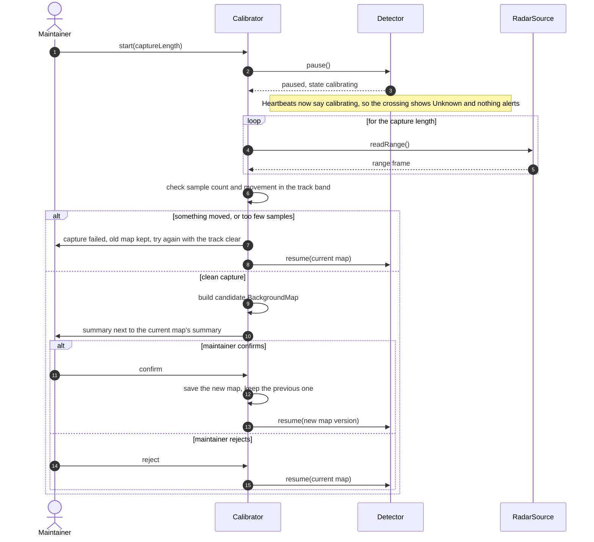

## Findings from this phase

Drawing the diagrams turned up three things. The first was significant and is now settled as D4.

1. **What one node can see depends on where it sits (OQ18).** The radar reaches about 100 m, so a node 550 m down the track can't see the crossing, and a node at the crossing gives only seconds of warning. **Settled as [D4](00_README.md#decisions):** the single node goes at the crossing; two nodes get spaced out later. None of the diagrams above change; only the Detector's evidence does ([06_state_machines.md](06_state_machines.md#how-the-node-knows-it-depends-on-placement-oq18-decided-as-d4)).
2. **Cold-start notification taps (SD9).** The app's `onAlertTapped` uses a response listener. When a tap launches the app from fully closed, that response can arrive before the listener exists; Expo provides `getLastNotificationResponseAsync()` for exactly this case. Worth checking on the dev build. It is the most common way UC7 starts.
3. **The 20-crossing cap is silent** (UC4 7b). Nothing in the diagrams changes, but the app should say so when it happens.
