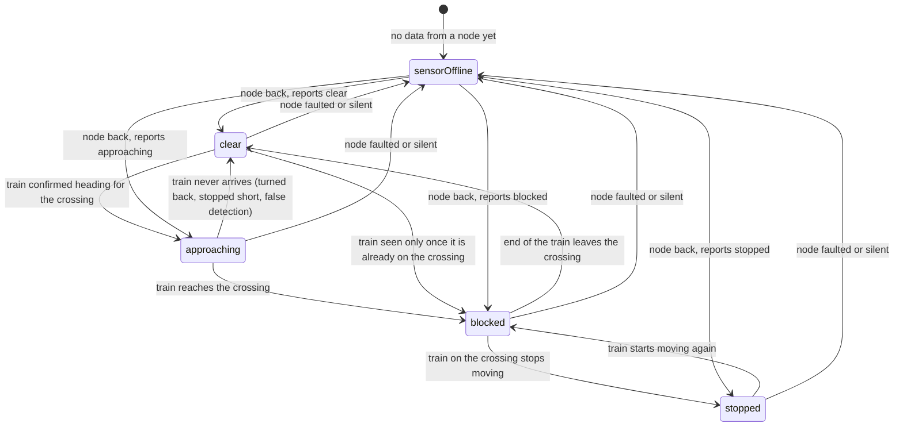
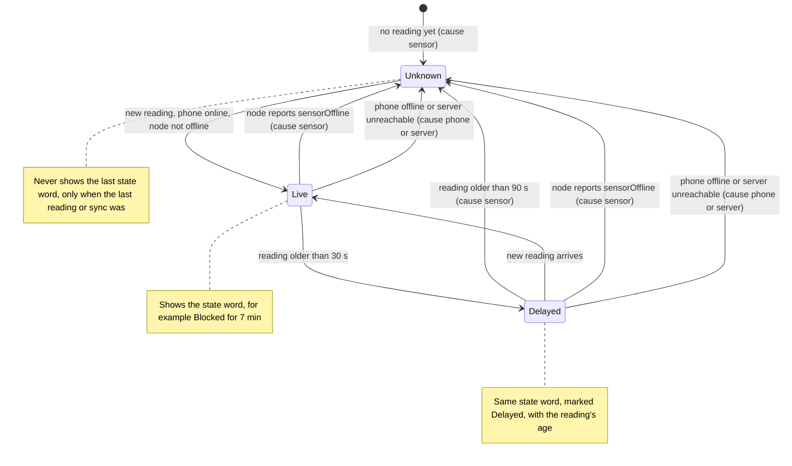
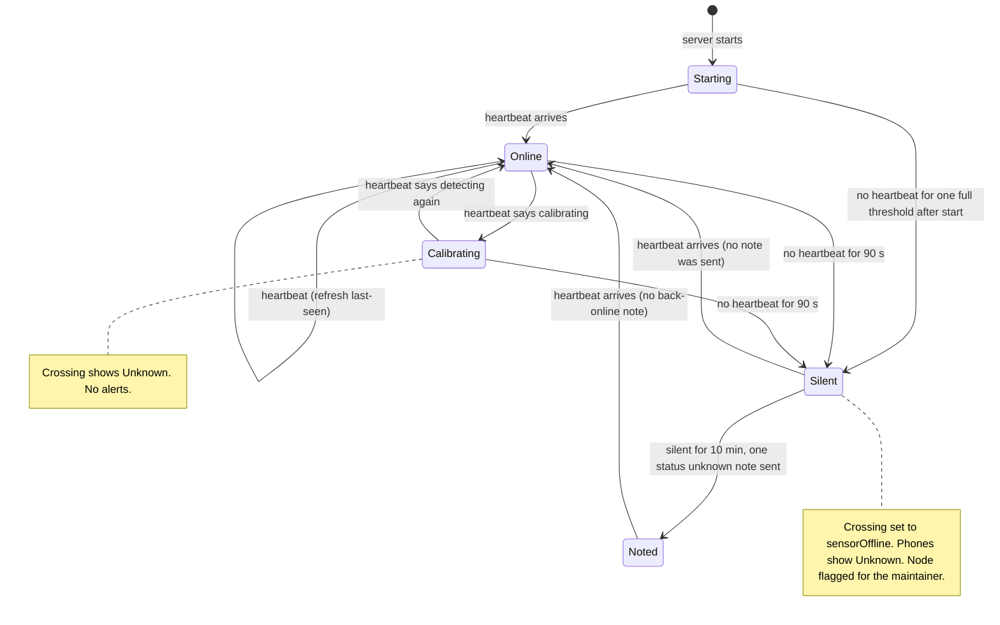
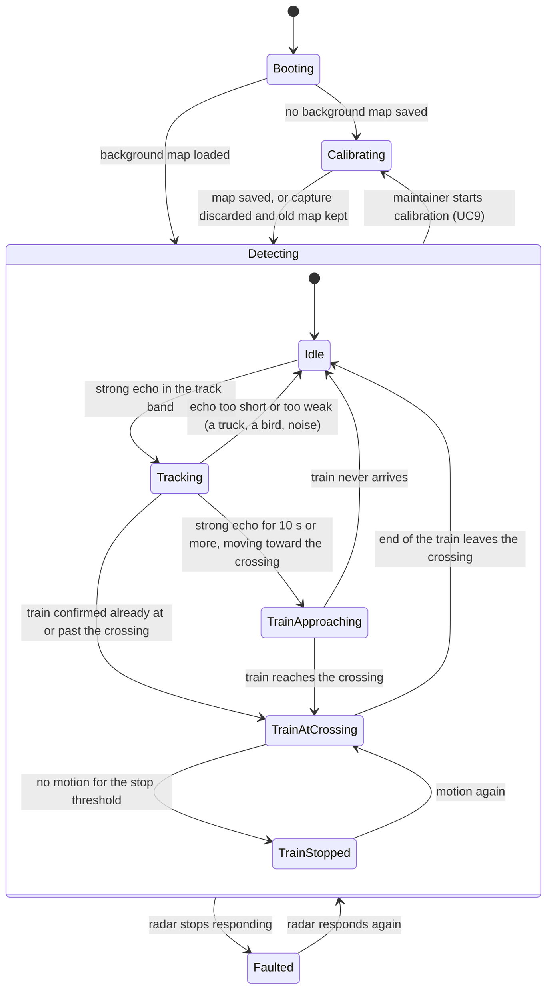

# 06 State Machines

Phase 5 of the blueprint, part two. Four state machines: the crossing (what everyone agrees the crossing is doing), the app's freshness rule (whether the screen can trust it), a node's liveness as the server sees it, and the node's own detector.

| Machine | Runs in | Drives |
| --- | --- | --- |
| [Crossing state](#1-crossing-state) | The node's Detector (OQ1 lean), mirrored by the server's CrossingTracker | Every alert (SD2, SD4) |
| [App freshness](#2-app-freshness) | The app, `app/src/domain/freshness.ts` | What Status, the map and the list show (SD9) |
| [Node liveness](#3-node-liveness-server-view) | The server's NodeMonitor | Offline detection and the "status unknown" note (SD5, SD6) |
| [Edge detector](#4-edge-detector) | The node's Detector | Crossing events (SD1), calibration (SD10) |

## 1. Crossing state

The five values of `ReportedState`, every legal change between them, and what triggers it. The labels say what has to be true; how the node knows it depends on where the node sits, which is the table after the diagram.

**What each change sends** (subject to the crossing's alert mode, D1, and each device's preferences):

| Change | Alert | Channel |
| --- | --- | --- |
| clear to approaching | approaching, at once (only in alert mode "all") | `train-alerts` |
| approaching or clear to blocked | blocked, after each device's minimum blockage time (SD4) | `train-alerts` |
| blocked to stopped | stopped, once, only to devices told "blocked" | `train-alerts` |
| blocked or stopped to clear | cleared, only to devices told "blocked" or "stopped" | `train-alerts` |
| approaching to clear | nothing (no blockage happened) | |
| anything to sensorOffline | "status unknown", once, after 10 minutes silent (SD6) | `service-status` |
| sensorOffline back to a state | nothing; phones simply show live status again | |

**Rules the diagram doesn't show:**

- **stopped never goes straight to clear.** A stopped train has to move to leave the crossing, so it passes through blocked. If the node somehow reports stopped then clear, the server treats it as stopped to blocked to clear and sends one cleared alert.
- **A second train while blocked stays blocked.** The blockage lasts until the crossing is actually clear.
- **sensorOffline doesn't end a blockage.** The open blockage and its scheduled checks stay; the node's state when it returns decides (UC3 3a).
- **Late and out-of-order events** (UC1 1b, 1c) don't move the current state backwards; they go to history only.

### How the node knows: it depends on placement (OQ18, decided as D4)

The radar reaches about 100 m. That makes what one node can observe depend entirely on where it sits.

| Trigger | One node at the crossing, within ~100 m (the plan, D4) | A node ~550 m down the track (each of two spaced nodes, later) |
| --- | --- | --- |
| Train heading for the crossing | Seen, but only ~100 m out: about 5 seconds of warning at 40 mph | Seen when it passes the node: about 30 to 40 seconds of warning at 30 to 40 mph, matching the gate window. **Only for trains coming from the node's side.** |
| Train reaches the crossing | Seen directly | **Estimated** from when the train passed the node and its speed |
| Train on the crossing stops | Seen directly (FMCW range shows a stationary train against the background map) | Seen only if the train is long enough to still be in the node's view, which is common for freight trains over 550 m long |
| End of the train leaves the crossing | Seen directly | **Estimated** from when the tail passed the node and its speed |
| Train from the other side | Seen like any other | Seen only after it has already crossed, so it goes straight from clear to blocked with no approaching alert |

**Decided ([D4](00_README.md#decisions)):** while there is one node, it sits at the crossing, so the left column is the plan for Sprint 3: every crossing state is observed, not estimated, which is what the app's trust rule needs. The right column becomes relevant when a second node is funded and the two are spaced out, one on each side; blocked and cleared then come from timing on both sides. The machine above doesn't change between the two; only the Detector's evidence does.

The cost of the decision is warning time: with one node at the crossing, "approaching" comes only seconds ahead. Whether to push it at all is [OQ19](00_README.md#open-questions).

## 2. App freshness

This is `effectiveState()` in `app/src/domain/freshness.ts`, drawn as states. The app computes it fresh on every snapshot (once a second), so these aren't stored states; the diagram shows which one applies as a reading ages or the connection changes. The thresholds are `Freshness.liveMaxSeconds` (30) and `Freshness.delayedMaxSeconds` (90) in `constants/theme.ts`.

What this means for the server: the app only stays Live if `lastReadingAt` on the crossing document is refreshed at least every 30 seconds, and drops to Unknown on its own if it isn't refreshed for 90. That is what pins the heartbeat cadence in [OQ7](00_README.md#open-questions): every 30 seconds, each one refreshing `lastReadingAt`. It also means the app is safe even if the whole server dies: the document stops changing and every phone shows Unknown within 90 seconds.

## 3. Node liveness (server view)

The NodeMonitor's view of each node, from heartbeats (SD5) and the once-a-minute check that Cloud Scheduler triggers (SD6, D5). The offline threshold matches the app: three missed heartbeats, 90 seconds at a 30-second cadence.

Health readings out of range (low battery, high temperature) are a separate flag on the node, not a state here: a node can be Online and still need attention (UC12).

## 4. Edge detector

The node's own state machine, inside the Detector. It is written to stay free of Linux-only assumptions (a stated goal), so it could move to an ESP32-S3 later: it takes Detections in and produces CrossingEvents out, and knows nothing about SQLite, HTTP or serial ports.

**Which changes produce a CrossingEvent** (SD1):

| Detector change | CrossingEvent | Crossing state it reports |
| --- | --- | --- |
| into TrainApproaching | yes | approaching |
| into TrainAtCrossing | yes | blocked |
| into TrainStopped | yes | stopped |
| TrainAtCrossing back to Idle | yes | clear |
| TrainApproaching back to Idle | yes | clear |
| into Faulted | yes | sensorOffline |
| Idle and Tracking | no | (internal: not yet a train) |
| Calibrating | no events; heartbeats say calibrating | (Unknown to phones) |

**Log-only mode is not a state.** In log-only mode the detector runs exactly the same machine; every CrossingEvent it produces is marked log-only, so the server records it but never alerts on it. That keeps one code path for both modes, which is what makes log-only weeks a fair test of the real thing. The crossing's alert mode on the server (UC13, D1) is a second, independent gate: a node out of log-only still can't send approaching alerts until the crossing's mode allows them.

**The thresholds are placeholders.** "10 s or more", "strong echo", "stop threshold" and the track band are starting values from the architecture diagram. Log-only weeks exist to measure them. They belong in node configuration, not in code.
