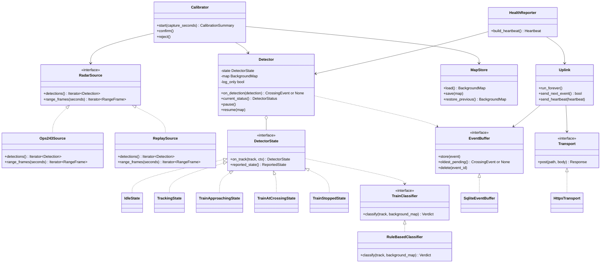
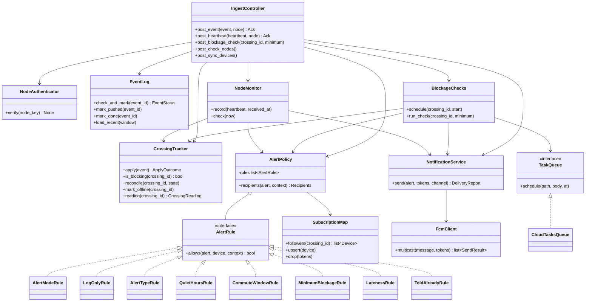
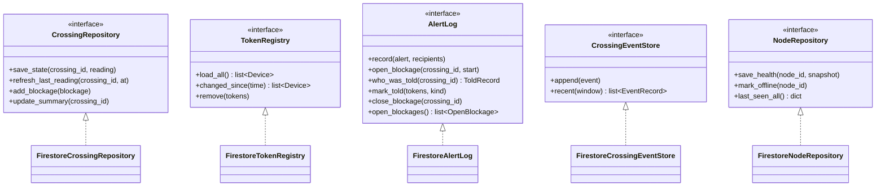
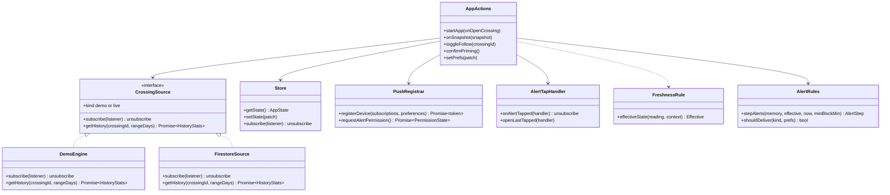

# 08 Design Class Diagrams and Module Map

Phase 7 of the blueprint. For each component (`edge/`, `server/`, `app/`): a class diagram with the methods the sequence diagrams require, the interfaces written out, and where each piece lives. Then the **shared contract**: the exact shape of what the node sends the server and what the server writes to Firestore. The contract is what lets edge and server be built in parallel by different people.

Every method traces to a numbered message in [05_sequence_diagrams.md](05_sequence_diagrams.md); each component ends with that trace. The patterns come from [07_design_patterns.md](07_design_patterns.md). Signatures are design, not final code: names and types can change when the code is written, as long as the trace still holds.

Python components use `snake_case` and `typing.Protocol` for interfaces; the app uses `camelCase` and TypeScript interfaces, matching the existing code.

## Contents

1. [Edge](#1-edge-edge): node classes, interfaces, module layout, trace
2. [Server](#2-server-server): server classes, interfaces, module layout, trace
3. [App](#3-app-app): existing files, the minimal additions, trace
4. [Shared contract](#4-shared-contract): node payloads, Firestore documents
5. [Scaling past one instance](#5-scaling-past-one-instance-oq20)

---

## 1. Edge (`edge/`)

### Class diagram



### Interfaces

```python
from typing import Iterator, Protocol

class RadarSource(Protocol):
    def detections(self) -> Iterator["Detection"]: ...
    def range_frames(self, seconds: float) -> Iterator["RangeFrame"]: ...

class DetectorState(Protocol):
    def on_track(self, track: "Track", ctx: "DetectorContext") -> "DetectorState": ...
    def reported_state(self) -> "ReportedState": ...   # what a change into this state reports

class TrainClassifier(Protocol):
    def classify(self, track: "Track", background_map: "BackgroundMap") -> "Verdict": ...

class EventBuffer(Protocol):
    def store(self, event: "CrossingEvent") -> None: ...
    def oldest_pending(self) -> "CrossingEvent | None": ...
    def delete(self, event_id: str) -> None: ...

class Transport(Protocol):
    # Never raises for network errors: a failed send is a Response with ok=False.
    def post(self, path: str, body: dict) -> "Response": ...
```

The detector core (`Detector`, the states, `TrainClassifier`, `Track`, `Verdict`) imports nothing from `buffer/`, `transport/` or `radar/`. That keeps it portable to an ESP32-S3 and testable with no hardware.

### Module layout

```
edge/
  pyproject.toml
  .env.example                 NODE_ID, NODE_KEY, INGEST_URL, LOG_ONLY, thresholds
  mavradar_edge/
    __main__.py                wires everything and starts the loops
    config.py                  NodeConfig from environment variables
    contract.py                CrossingEvent, Heartbeat (mirror the shared contract, section 4)
    radar/
      source.py                RadarSource protocol, Detection, RangeFrame
      ops243.py                Ops243Source: OPS243-C over USB serial
      replay.py                ReplaySource: plays a recorded log
    detector/
      detector.py              Detector
      states.py                DetectorState and the five states
      classifier.py            TrainClassifier, RuleBasedClassifier, Verdict
      track.py                 Track built from Detections
      background.py            BackgroundMap, MapStore
    calibration/
      calibrator.py            Calibrator
    buffer/
      event_buffer.py          EventBuffer protocol, SqliteEventBuffer, MemoryEventBuffer
    transport/
      transport.py             Transport protocol, HttpsTransport, FakeTransport
    uplink/
      uplink.py                Uplink: send loop, backoff, heartbeats
    health/
      reporter.py              HealthReporter
  tests/                       pytest; replay logs under tests/data/
  deploy/
    mavradar-edge.service      systemd unit
```

### Trace

| Method | Message |
| --- | --- |
| `RadarSource.detections()` | SD1 messages 1 and 2 |
| `Detector.on_detection()` | SD1 message 3 |
| `TrainClassifier.classify()` | SD1 message 4 |
| `DetectorState.on_track()`, new `CrossingEvent` | SD1 message 5 |
| `EventBuffer.store()` | SD1 message 6 |
| `EventBuffer.oldest_pending()` | SD1 messages 7 and 8 |
| `Uplink.send_next_event()`, `Transport.post()` | SD1 messages 9, 10, 12, 14, 16 |
| `EventBuffer.delete()` | SD1 messages 11 and 13 |
| `HealthReporter.build_heartbeat()` | SD5 message 1 |
| `Detector.current_status()` | SD5 messages 2 and 3 |
| `Uplink.send_heartbeat()` | SD5 messages 4 to 6 |
| `Calibrator.start()` | SD10 message 1 |
| `Detector.pause()` | SD10 messages 2 and 3 |
| `RadarSource.range_frames()` | SD10 messages 4 and 5 |
| `Calibrator.confirm()`, `MapStore.save()` | SD10 messages 11 and 12 |
| `Calibrator.reject()` | SD10 message 14 |
| `Detector.resume()` | SD10 messages 8, 13 and 15 |

---

## 2. Server (`server/`)

Two diagrams: the services that handle each request, and the repositories behind them.

The server runs on Cloud Run with **request-based billing, min-instances 1 and max-instances 1** ([D5](00_README.md#decisions), OQ20). It has no CPU between requests, so nothing runs in the background: the blockage checks arrive from Cloud Tasks, and the offline check and the follower sync arrive from Cloud Scheduler, each as an ordinary HTTP request.

### Class diagram: services



`AlertPolicy` also reads `AlertLog` (in the repositories diagram below) for `ToldAlreadyRule`, `IngestController` writes through the repositories before it acknowledges (SD3), and `post_sync_devices` goes through `TokenRegistry` to `SubscriptionMap.upsert` (SD8). Those links are left out of this diagram to keep it readable.

`NodeAuthenticator.verify` runs as a FastAPI dependency (`Depends`), so `post_event` and `post_heartbeat` receive an already-verified `Node` (07, Controller and Chain of Responsibility cards). The three `/tasks/...` endpoints use a different dependency: they accept only a Google-signed identity token for the scheduler's own service account, so neither a node nor anyone on the internet can call them.

### Class diagram: repositories



`AlertLog` keeps open blockages in memory and writes them through to Firestore (SD3), so `who_was_told` is a memory lookup on the hot path and a restarted server reloads them with `open_blockages()`. `TokenRegistry` is the interface Amendment 002 (4.2) asked for. It talks about devices and tokens, never about how a token was obtained, so the iOS decision (OQ14) can't leak into it: an iOS device is just a device whose `platform` is `ios`.

### Interfaces

```python
from typing import Protocol

class AlertRule(Protocol):
    def allows(self, alert: "Alert", device: "Device", ctx: "AlertContext") -> bool: ...

class TaskQueue(Protocol):
    # Creates an HTTP task that calls `path` on this service at `at`, with a
    # Google-signed identity token. FakeTaskQueue records tasks for tests.
    def schedule(self, path: str, body: dict, at: "datetime") -> None: ...

class CrossingRepository(Protocol):
    def save_state(self, crossing_id: str, reading: "CrossingReading") -> None: ...
    def refresh_last_reading(self, crossing_id: str, at: "datetime") -> None: ...
    def add_blockage(self, blockage: "BlockageEvent") -> None: ...
    def update_summary(self, crossing_id: str) -> None: ...

class TokenRegistry(Protocol):
    def load_all(self) -> list["Device"]: ...
    def changed_since(self, since: "datetime") -> list["Device"]: ...   # by updatedAt
    def remove(self, tokens: list[str]) -> None: ...

class AlertLog(Protocol):
    def record(self, alert: "Alert", recipients: list[str]) -> None: ...
    def open_blockage(self, crossing_id: str, start: "datetime") -> None: ...
    def who_was_told(self, crossing_id: str) -> "ToldRecord": ...
    def mark_told(self, crossing_id: str, tokens: list[str], kind: "AlertKind") -> None: ...
    def close_blockage(self, crossing_id: str) -> None: ...
    def open_blockages(self) -> list["OpenBlockage"]: ...

class CrossingEventStore(Protocol):
    def append(self, event: "CrossingEvent") -> None: ...
    def recent(self, window: "timedelta") -> list["EventRecord"]: ...   # id and status, for EventLog reloads

class NodeRepository(Protocol):
    def save_health(self, node_id: str, snapshot: "HealthSnapshot") -> None: ...
    def mark_offline(self, node_id: str) -> None: ...
    def last_seen_all(self) -> dict[str, "datetime"]: ...
```

### Module layout

```
server/
  pyproject.toml
  Dockerfile
  .env.example                 GOOGLE_CLOUD_PROJECT, TASKS_QUEUE, SCHEDULER_SA_EMAIL,
                               thresholds (no keys)
  deploy/
    cloudrun.md                the service settings: request-based billing,
                               min-instances 1, max-instances 1, 1 vCPU, 512 MiB
    scheduler.md               the two Cloud Scheduler jobs and the Cloud Tasks queue
  app/
    main.py                    FastAPI app; lifespan builds every object once, loads
                               SubscriptionMap, EventLog and open blockages (07,
                               Singleton card)
    config.py                  Settings from environment variables
    contract.py                Pydantic models for the shared contract (section 4)
    api/
      deps.py                  get_services(), verify_node(), verify_scheduler()
      events.py                POST /events -> IngestController.post_event
      heartbeats.py            POST /heartbeats -> IngestController.post_heartbeat
      tasks.py                 POST /tasks/blockage-check, /tasks/check-nodes,
                               /tasks/sync-devices (scheduler identity only)
      health.py                GET /healthz for Cloud Run
    controllers/
      ingest.py                IngestController
    services/
      auth.py                  NodeAuthenticator (per-node keys from Secret Manager, OQ3)
      event_log.py             EventLog (new, pushed, done)
      crossing_tracker.py      CrossingTracker
      alert_policy.py          AlertPolicy
      alert_rules.py           the AlertRule classes
      subscriptions.py         SubscriptionMap
      notifications.py         NotificationService, FcmClient
      blockage_checks.py       BlockageChecks
      task_queue.py            TaskQueue, CloudTasksQueue, FakeTaskQueue
      node_monitor.py          NodeMonitor
    repositories/
      base.py                  the repository protocols
      firestore.py             Firestore implementations
      memory.py                in-memory twins for tests
    domain/
      models.py                CrossingEvent, Heartbeat, Node, Device, Alert, BlockageEvent, ...
      crossing_state.py        legal changes and the alert each one calls for (pure, no I/O)
  tests/
    unit/                      services against in-memory repositories, a fake FCM
                               and FakeTaskQueue
    integration/               Firestore emulator; FCM in dry-run mode
```

`domain/crossing_state.py` holds the crossing state machine from [06](06_state_machines.md#1-crossing-state) as pure functions: is a change legal, and which alert does it call for. The node's detector decides states (OQ1); the server only checks and reacts, so it needs no State classes of its own.

### Trace

| Method | Message |
| --- | --- |
| `IngestController.post_event()` | SD2 message 1 |
| `NodeAuthenticator.verify()` | SD2 messages 2 to 5; SD5 messages 7 to 10 |
| validation in `post_event()` | SD2 messages 6 and 7 |
| `EventLog.check_and_mark()` | SD2 messages 8 to 12 |
| `CrossingTracker.apply()` | SD2 messages 13 and 14 |
| `AlertPolicy.recipients()` | SD2 messages 15 and 18; SD4 messages 8, 10, 16, 18, 21, 23; SD6 messages 9 and 12 |
| `SubscriptionMap.followers()` | SD2 messages 16 and 17; SD6 messages 10 and 11 |
| `NotificationService.send()` | SD2 messages 19 and 23; SD4 messages 11, 19, 24; SD6 message 13 |
| `FcmClient.multicast()` | SD2 messages 20 to 22; SD4 message 12; SD6 message 14 |
| `EventLog.mark_pushed()` | SD2 message 24 |
| `CrossingRepository.save_state()` | SD3 messages 1 and 2; SD6 messages 6 and 7 |
| `AlertLog.record()` | SD3 messages 3 and 4 |
| `CrossingRepository.add_blockage()`, `update_summary()` | SD3 messages 5 and 6 |
| `TokenRegistry.remove()` | SD3 messages 7 and 8 |
| `SubscriptionMap.drop()` | SD3 message 9 |
| `EventLog.mark_done()`, `CrossingEventStore.append()` | SD3 message 10 |
| acknowledgement (or 503) from `post_event()` | SD3 messages 11 and 12 |
| `AlertLog.open_blockage()` | SD4 message 1 |
| `BlockageChecks.schedule()` | SD4 message 2 |
| `TaskQueue.schedule()` | SD4 messages 3 and 4 |
| `IngestController.post_blockage_check()` | SD4 messages 5 and 15 |
| `BlockageChecks.run_check()` | SD4 messages 6 and 14 |
| `CrossingTracker.is_blocking()` | SD4 message 7 |
| `AlertLog.who_was_told()` | SD4 messages 9, 17 and 22 |
| `AlertLog.mark_told()` | SD4 messages 13 and 20 |
| `AlertLog.close_blockage()` | SD4 message 25 |
| `IngestController.post_heartbeat()` | SD5 messages 5 and 22 |
| `NodeMonitor.record()` | SD5 messages 11 and 12 |
| `CrossingTracker.reconcile()` | SD5 messages 13 to 15 |
| health limits in `NodeMonitor.record()` | SD5 messages 16 and 17 |
| `CrossingRepository.refresh_last_reading()` | SD5 messages 18 and 19 |
| Cloud Logging write in `NodeMonitor.record()` | SD5 message 20 |
| `NodeRepository.save_health()` | SD5 message 21 |
| `IngestController.post_check_nodes()` | SD6 messages 1 and 16 |
| `NodeMonitor.check()` | SD6 messages 2 and 3 |
| `CrossingTracker.mark_offline()` | SD6 messages 4 and 5 |
| `NodeRepository.mark_offline()` | SD6 message 8 |
| `TokenRegistry.load_all()`, `SubscriptionMap.upsert()` at startup | SD8 messages 1 to 4 |
| `IngestController.post_sync_devices()` | SD8 messages 5 and 13 |
| `TokenRegistry.changed_since()` | SD8 messages 6 to 9 and 12 |
| `SubscriptionMap.upsert()` | SD8 messages 10 and 11 |

---

## 3. App (`app/`)

The app is already built around the right seams (07, app cards), so this is a map of what exists plus the smallest set of additions the blueprint calls for. None of these changes are made here; they become tasks in Phase 8.

### Class diagram



### Existing files and what changes

| Object | File | Status | Change the blueprint calls for |
| --- | --- | --- | --- |
| CrossingSource | `data/source.ts` | exists | Add `getHistory(crossingId, rangeDays)` (OQ11). |
| DemoEngine | `data/demo-engine.ts` | exists | Implement `getHistory` from `demo-history.ts`. |
| FirestoreSource | `data/firestore-source.ts` | exists, unused | Read `getHistory` from `crossings/{id}/summary/{7d or 30d}`. Map the contract's `nodes` summary onto `sensorName` and `sensorBatteryOk`. |
| Store | `state/store.ts` | exists | None. |
| AppActions | `state/actions.ts` | exists | `onSnapshot`: run local alerts only when `source.kind === 'demo'` (OQ10). `syncDevice`: pass the alert preferences (OQ9). |
| AlertRules | `domain/alerts.ts` | exists | Add `approaching` to `AlertKind` and `AlertType` (D1), off by default, for the demo and for the Settings switch. |
| FreshnessRule | `domain/freshness.ts` | exists | None. Its 30 s and 90 s thresholds are now part of the contract (section 4). |
| PushRegistrar | `lib/push.ts` | exists | `registerDevice(subscriptions, preferences)` writes the preference fields in section 4. |
| AlertTapHandler | `lib/alert-delivery.ts` | exists | Add `openLastTapped` using `getLastNotificationResponseAsync()` for cold starts (SD9 finding). |
| History screen | `app/history.tsx` | exists | Read from `source.getHistory()` instead of `DEMO_HISTORY`. |
| Settings | `app/settings.tsx` | exists | Say so when a follow is past the 20-crossing cap (UC4 7b). An "Approaching" alert switch, hidden while no crossing allows approaching pushes (OQ19). |
| Firestore rules | `firestore.rules` | exists | Allow the preference fields on `devices/{token}` (OQ9) and reads of `crossings/{id}/summary/{range}` (OQ11). |

### Interface change

```ts
// data/source.ts
export interface CrossingSource {
  readonly kind: 'demo' | 'live';
  /** Calls `listener` right away and on every change. Returns an unsubscribe function. */
  subscribe(listener: (snapshot: SourceSnapshot) => void): () => void;
  /** 7- or 30-day blockage statistics (OQ11). One read of the summary document. */
  getHistory(crossingId: string, rangeDays: 7 | 30): Promise<HistoryStats>;
}

// domain/types.ts: the same shape as RangeStats in data/demo-history.ts today
export interface HistoryStats {
  count: number;
  typicalMin: number;
  longestMin: number;
  longestStopped: boolean;
  /** Average blockages in each hour of the day, midnight first. 24 values. */
  hours: number[];
}
```

### Trace

| Method | Message |
| --- | --- |
| `AppActions.toggleFollow()` / `confirmPriming()` adding the follow | SD7 message 1 |
| `PushRegistrar.registerDevice()` | SD7 messages 2 to 16 |
| `AppActions` snackbar | SD7 message 17 |
| `AlertTapHandler.onAlertTapped()` / `openLastTapped()` | SD9 messages 2 to 5 |
| `Store` read by `StatusScreen` | SD9 message 6 |
| `CrossingSource.subscribe()` | SD9 messages 7 to 10 |
| `FreshnessRule.effectiveState()` | SD9 messages 11 and 12 |

`getHistory` has no sequence diagram; it serves UC8, which is a brief use case. It is a single document read.

---

## 4. Shared contract

The one place the shape of every message and stored document is written down. Edge, server and app each keep their own copy in code (`edge/mavradar_edge/contract.py`, `server/app/contract.py`, `app/src/domain/types.ts`), and those copies must match this section. Changing a field means changing this section first, in a PR everyone sees.

**Conventions**

- Times in HTTP bodies are ISO 8601 UTC strings with milliseconds, like `2026-10-08T21:14:03.250Z`. Times in Firestore are Firestore Timestamps.
- Crossing IDs are USDOT crossing IDs, like `794978C`.
- Every body carries `schemaVersion`, starting at `1`, so an older node can be recognised after a contract change.
- No coordinates of a node, ever. A node has a side and a rough distance, nothing more.

### Node to server: authentication and responses

Every request carries the node's key as `Authorization: Bearer <node key>` (OQ3). The key lives in the node's environment and in Secret Manager, never in the repo.

| Response | Meaning | What the node does (SD1, SD5) |
| --- | --- | --- |
| `200 {"eventId": "...", "status": "accepted"}` | Processed | Delete from the buffer |
| `200 {"eventId": "...", "status": "duplicate"}` | Seen before | Delete from the buffer |
| `401` | Unknown node or wrong key | Keep, log, retry later |
| `422 {"error": "..."}` | Invalid, will never succeed | Delete and log |
| `503` | Pushed, but the database writes didn't finish (SD3) | Keep, back off, retry with the same `eventId`; the server won't push again |
| `5xx`, timeout, no network | Temporary | Keep, back off, retry with the same `eventId` |

### `POST /events`: a CrossingEvent

```json
{
  "$schema": "https://json-schema.org/draft/2020-12/schema",
  "title": "CrossingEvent",
  "type": "object",
  "required": ["schemaVersion", "eventId", "nodeId", "crossingId", "fromState", "toState", "occurredAt", "logOnly"],
  "additionalProperties": false,
  "properties": {
    "schemaVersion": { "const": 1 },
    "eventId": { "type": "string", "format": "uuid", "description": "Made by the node when it records the event (OQ6). The same on every retry." },
    "nodeId": { "type": "string", "minLength": 1 },
    "crossingId": { "type": "string", "pattern": "^[0-9]{6}[A-Z]$", "description": "USDOT crossing ID" },
    "fromState": { "$ref": "#/$defs/reportedState" },
    "toState": { "$ref": "#/$defs/reportedState" },
    "occurredAt": { "type": "string", "format": "date-time", "description": "When the node saw the change, node clock" },
    "logOnly": { "type": "boolean", "description": "True while the node is in log-only mode. The server records but never alerts." },
    "train": {
      "type": "object",
      "description": "What the detector measured, for tuning. Optional.",
      "additionalProperties": false,
      "properties": {
        "speedMps": { "type": "number", "minimum": 0 },
        "direction": { "enum": ["toward", "away"] },
        "rangeM": { "type": "number", "minimum": 0 },
        "confidence": { "type": "number", "minimum": 0, "maximum": 1 }
      }
    },
    "classifierVersion": { "type": "string" }
  },
  "$defs": {
    "reportedState": { "enum": ["clear", "approaching", "blocked", "stopped", "sensorOffline"] }
  }
}
```

Example:

```json
{
  "schemaVersion": 1,
  "eventId": "6f1c2a9e-3b7d-4f0a-9a51-2d8e4b7c1f03",
  "nodeId": "node-a",
  "crossingId": "794978C",
  "fromState": "approaching",
  "toState": "blocked",
  "occurredAt": "2026-10-08T21:14:03.250Z",
  "logOnly": true,
  "train": { "speedMps": 11.2, "direction": "toward", "rangeM": 12.5, "confidence": 0.93 },
  "classifierVersion": "rules-0.1"
}
```

### `POST /heartbeats`: a Heartbeat

```json
{
  "$schema": "https://json-schema.org/draft/2020-12/schema",
  "title": "Heartbeat",
  "type": "object",
  "required": ["schemaVersion", "nodeId", "sentAt", "status", "state", "logOnly", "batteryVoltage", "enclosureTempC", "uptimeSec", "softwareVersion", "mapVersion"],
  "additionalProperties": false,
  "properties": {
    "schemaVersion": { "const": 1 },
    "nodeId": { "type": "string", "minLength": 1 },
    "sentAt": { "type": "string", "format": "date-time", "description": "Node clock. The server uses its own arrival time for freshness (SD5)." },
    "status": { "enum": ["detecting", "calibrating", "faulted"] },
    "state": { "enum": ["clear", "approaching", "blocked", "stopped", "sensorOffline"], "description": "The detector's current state, so the server can restore a crossing after an outage" },
    "logOnly": { "type": "boolean" },
    "batteryVoltage": { "type": "number" },
    "enclosureTempC": { "type": "number" },
    "uptimeSec": { "type": "integer", "minimum": 0 },
    "signalDbm": { "type": ["number", "null"] },
    "softwareVersion": { "type": "string" },
    "mapVersion": { "type": "string" },
    "bufferedEvents": { "type": "integer", "minimum": 0, "description": "Events waiting in the node's buffer" }
  }
}
```

**Timing, part of the contract** (OQ7, OQ17, D5): a heartbeat every 30 seconds; the server marks a node offline after 90 seconds with no heartbeat, checked once a minute; the app shows Delayed after 30 seconds and Unknown after 90 (`Freshness` in `app/src/constants/theme.ts`); approaching alerts are dropped if the event is more than 60 seconds old, cleared alerts if more than 10 minutes old; blockage checks at 1, 3 and 5 minutes; a follow or unfollow reaches the server within a minute.

### Firestore documents

The app reads the first four; the rest are server-only. "Writer" is who writes the document; Firestore rules enforce it.

**`crossings/{usdotId}`**: current state. Writer: server. Reader: app (`FirestoreSource`).

| Field | Type | Notes |
| --- | --- | --- |
| `state` | string | One of the five `ReportedState` values |
| `since` | Timestamp or null | Start of the current blockage |
| `stoppedAt` | Timestamp or null | When the train stopped |
| `detectedAt` | Timestamp or null | When an approaching train was seen |
| `clearSince` | Timestamp or null | When the crossing last cleared |
| `lastReadingAt` | Timestamp | Last heartbeat's arrival time; refreshed every 30 s (OQ7) |
| `sensor` | map | `{ name, batteryOk }`, derived from the crossing's nodes (OQ12, D2); kept so the app works unchanged |
| `nodeIds` | array of strings | The nodes watching this crossing (zero to two) |
| `alertMode` | string | `logOnly`, `blockedAndCleared` or `all` (D1, UC13). Stays `blockedAndCleared` while one node sits at the crossing (OQ19). |
| `updatedAt` | Timestamp | Server write time |

These are exactly the fields `FirestoreSource.toReading()` already reads, plus three new ones the app can ignore.

**`crossings/{usdotId}/events/{blockageId}`**: one finished blockage (BlockageEvent). Writer: server, after the blockage clears. Reader: app.

| Field | Type | Notes |
| --- | --- | --- |
| `start` | Timestamp | |
| `end` | Timestamp | The SRS's blockage history asks for start, end and duration |
| `durationMin` | number | |
| `stopped` | boolean | Whether the train stopped during it |

**`crossings/{usdotId}/summary/{range}`**, with `range` either `7d` or `30d`: history statistics (OQ11). Writer: server, after each blockage and once a day. Reader: app (`getHistory`).

| Field | Type | Notes |
| --- | --- | --- |
| `rangeDays` | number | 7 or 30 |
| `count` | number | Blockages in the range |
| `typicalMin` | number | Median duration |
| `longestMin` | number | |
| `longestStopped` | boolean | Whether the longest one involved a stopped train |
| `hours` | array of 24 numbers | Average blockages per hour of day, midnight first |
| `updatedAt` | Timestamp | |

Same shape as the app's `RangeStats` in `data/demo-history.ts`, so History switches from demo to live with no layout change.

**`devices/{fcmToken}`**: one phone. Writer: the app, through `registerDevice()`; deletes by the server when FCM reports the token invalid. Reader: server (`TokenRegistry`).

| Field | Type | Notes |
| --- | --- | --- |
| `uid` | string | Anonymous auth uid; authorizes writes, isn't the identity (Amendment 002, 4.1) |
| `platform` | string | `android` or `ios` |
| `updatedAt` | Timestamp | Must equal the request time (rules) |
| `subscriptions` | array of up to 20 crossing IDs | Followed crossings |
| `alertTypes` | map of booleans | `approaching`, `blocked`, `stopped`, `cleared` (new, OQ9) |
| `minBlockMin` | number | 1, 3 or 5 (new, OQ9) |
| `quietHours` | map or null | `{ start: "22:00", end: "06:00" }` while quiet hours are on (new, OQ9; the field is already allowed) |
| `commuteWindows` | array or null | `[{ days: [1,2,3,4,5], start: "07:00", end: "09:00" }, ...]` while commute windows are on (new, OQ9) |
| `timeZone` | string | IANA name, like `America/Chicago`, so the server reads quiet hours and commute windows in the phone's local time (new, OQ9) |

None of these identify a person. "Mute today" stays on the phone.

**`nodes/{nodeId}`**: server-only. Writer: server.

| Field | Type | Notes |
| --- | --- | --- |
| `crossingId` | string | The crossing it watches |
| `side` | string | `atCrossing`, `east` or `west` (D4) |
| `lastSeenAt` | Timestamp | Updated in memory every heartbeat, written here every 5 minutes |
| `status` | string | `online`, `calibrating`, `offline` |
| `health` | map | `batteryVoltage`, `enclosureTempC`, `uptimeSec`, `signalDbm`, `bufferedEvents` |
| `flags` | array of strings | Out-of-range readings for the maintainer (UC12) |
| `softwareVersion`, `mapVersion` | string | |

**Server-only logs**: the CrossingEvent log (every accepted event, including log-only ones; feeds false-alarm measurement and `EventLog` reloads), the alert log (each alert, its channel, and sent and failed counts), and open blockage records (`AlertLog`, OQ16). Their exact layout is the server team's choice, since nothing else reads them.

---

## 5. Scaling past one instance (OQ20)

The server runs at `max-instances=1` because these live in the instance's memory. To scale out, each moves to a shared store. None of this is needed for one crossing.

| In memory today | Why it can't be split as is | Where it would move |
| --- | --- | --- |
| `CrossingTracker` current state | Two instances would disagree about a crossing | Firestore transaction on the crossing document, or Memorystore (Redis) |
| `EventLog` recent IDs and their states | Both instances could accept one retried event | A create-if-absent write keyed by `eventId` |
| `AlertLog` open blockages | Who-was-told would diverge | Firestore transaction per blockage |
| `NodeMonitor` last-seen times | Both could send "status unknown" | Already triggered by one Cloud Scheduler job; last-seen would move to Firestore |
| `SubscriptionMap` | Fine to duplicate | Stays in memory; each instance loads and syncs every device |
| Blockage checks | Already outside the server | Cloud Tasks (D5) |

Each of these adds a network round trip on the hot path, which is the main reason to stay at one instance until the load actually demands more.
