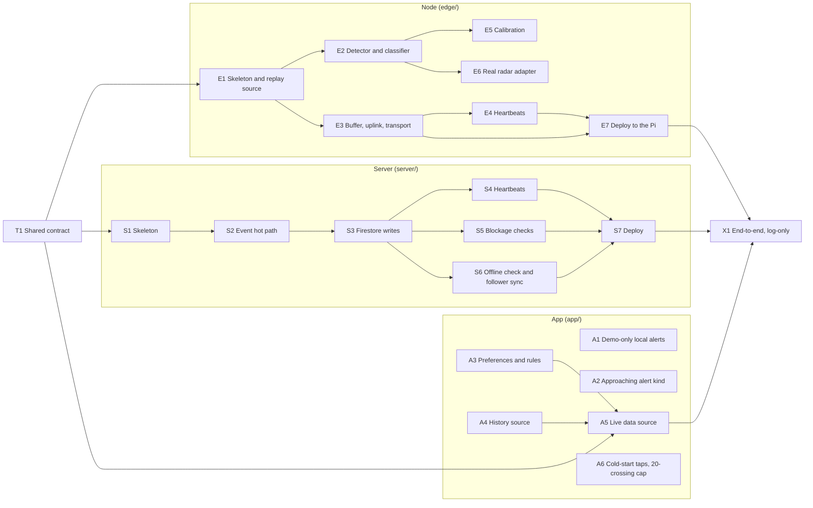

# 09 Build Order

Phase 8 of the blueprint. Candidate tasks for Sprint 3 and after, in dependency order. Each task names its use case, the sequence diagrams it implements, the files it creates (from the module layouts in [08_design_class_diagrams.md](08_design_class_diagrams.md)), and a definition of done that includes tests.

These are **candidates, not commitments**. No Jira issues have been created; Fernando decides what goes into Sprint 3 and who takes what. Sizes are rough: **S** is a day or two, **M** about a week, **L** more than a week for one person.

## How the work fits together

Four tracks can run in parallel once the shared contract exists: the node (`edge/`), the server (`server/`), the app (`app/`), and docs. Nothing on the node or server needs the radar to arrive first, because the node is built and tested against recorded radar logs (07, Adapter card).

**A suggested first slice for Sprint 3**, if the team wants one: T1, E1 to E3, S1 to S3, A1 and A3, plus the docs tasks D1 and D2. That gives a node that detects from recorded logs and buffers its events, a server that takes an event, pushes in FCM dry-run mode and writes Firestore, and the app ready to read it. Everything later builds on that without rework.

---

## T1: Shared contract (start here)

- **Use cases:** UC1, UC2. **Diagrams:** SD1, SD2, SD5. **Size:** S.
- **Why first:** it is the only thing both the node and the server depend on. Once it is in, the two can be built by different people at the same time.
- **Creates:**
  - `contract/schemas/crossing-event.schema.json` and `contract/schemas/heartbeat.schema.json`, copied from 08 section 4
  - `contract/examples/` with valid and invalid example payloads
  - `edge/mavradar_edge/contract.py` (dataclasses)
  - `server/app/contract.py` (Pydantic models)
- **Done when:**
  - Both the edge and the server code validate every example in `contract/examples/`: valid ones pass, invalid ones fail, in pytest on both sides.
  - The timing values (30 s heartbeat, 90 s offline, 60 s and 10 min lateness limits) are constants in one place on each side, with a comment pointing to 08 section 4.
  - A short `contract/README.md` says the rule: change the contract here first, in a PR everyone reviews.

---

## Node (`edge/`)

### E1: Skeleton, config and the replay source

- **Use cases:** UC1, UC9. **Diagrams:** SD1 messages 1 to 3, SD10 messages 4 and 5. **Size:** M. **Needs:** T1.
- **Creates:** `pyproject.toml`, `config.py`, `radar/source.py` (the `RadarSource` protocol, `Detection`, `RangeFrame`), `radar/replay.py`, `.env.example`, and a documented recorded-log format with a few synthetic logs under `tests/data/` (a train approaching and passing, a train stopping, a truck, an empty track).
- **Done when:** `ReplaySource` plays each log at real speed and faster; pytest covers parsing and timing; `pip install -e .` and `pytest` work on a fresh machine (and on the Pi, which runs the same Python).

### E2: Detector and classifier

- **Use cases:** UC1. **Diagrams:** SD1 messages 3 to 6; 06, edge detector. **Size:** L. **Needs:** E1.
- **Creates:** `detector/detector.py`, `detector/states.py` (the five states), `detector/classifier.py` (`TrainClassifier`, `RuleBasedClassifier`, `Verdict`), `detector/track.py`, `detector/background.py`.
- **Done when:**
  - Replaying each synthetic log produces exactly the CrossingEvents in 06's "Which changes produce a CrossingEvent" table, and none for the truck and the empty track.
  - Every event carries a new `eventId` and the log-only flag from config.
  - Thresholds come from config, not code.
  - The detector package imports nothing from `buffer/`, `transport/` or `radar/ops243.py` (a test checks the imports), so it stays portable.

### E3: Event buffer, uplink and transport

- **Use cases:** UC1. **Diagrams:** SD1 messages 6 to 16. **Size:** M. **Needs:** E1, T1.
- **Creates:** `buffer/event_buffer.py` (SQLite and in-memory), `transport/transport.py` (`HttpsTransport`, `FakeTransport`), `uplink/uplink.py`.
- **Done when:**
  - With `FakeTransport`, tests cover every row of the response table in 08 section 4: 200 accepted, 200 duplicate, 401, 422, 503, timeout and no network. Each leaves the buffer exactly as that row says.
  - A retry always sends the same `eventId`.
  - A power-cut test (kill the process mid-send, restart) loses no event.
  - The uplink loop never blocks detection.

### E4: Heartbeats

- **Use cases:** UC2. **Diagrams:** SD5 messages 1 to 6. **Size:** S. **Needs:** E3.
- **Creates:** `health/reporter.py`.
- **Done when:** a heartbeat goes out every 30 seconds with every field in the contract (battery voltage and temperature from the INA219 and sensor, or stubbed with a clear TODO until the hardware is wired). Failed heartbeats are dropped, not buffered. Tests use `FakeTransport`.

### E5: Calibration

- **Use cases:** UC9. **Diagrams:** SD10. **Size:** M. **Needs:** E2.
- **Creates:** `calibration/calibrator.py` and a small command-line entry point to start, confirm or reject a capture.
- **Done when:** replay tests cover a clean capture, a capture with movement (discarded, old map kept), too few samples, reject, and a restart mid-calibration. The previous map is always kept.

### E6: Real radar adapter (when the OPS243-C arrives)

- **Use cases:** UC1, UC9. **Diagrams:** SD1 messages 1 and 2. **Size:** M. **Needs:** E2 and the hardware.
- **Creates:** `radar/ops243.py`, and a recorder that saves real radar output in the replay format.
- **Done when:** the adapter configures the radar and produces Detections and range frames on the bench. Real recordings are added under `tests/data/` and the E2 tests run against them too.

### E7: Deploy to the Pi

- **Use cases:** UC1, UC2. **Size:** S. **Needs:** E3, E4.
- **Creates:** `deploy/mavradar-edge.service` (systemd) and an install guide in `edge/README.md`.
- **Done when:** the service starts on boot, restarts on crash, reads its node key from the environment (never the repo), and runs in log-only mode by default.

---

## Server (`server/`)

### S1: Skeleton

- **Use cases:** all server use cases. **Size:** S. **Needs:** T1.
- **Creates:** `pyproject.toml`, `Dockerfile`, `app/main.py` (lifespan that builds each object once, 07 Singleton card), `app/config.py`, `api/deps.py`, `api/health.py`, `repositories/base.py`, `repositories/memory.py`.
- **Done when:** the service runs locally and in Docker; `GET /healthz` answers; tests can swap any dependency through FastAPI's dependency overrides.

### S2: The event hot path

- **Use cases:** UC1. **Diagrams:** SD2. **Size:** L. **Needs:** S1.
- **Creates:** `api/events.py`, `controllers/ingest.py`, `services/auth.py`, `services/event_log.py` (new, pushed, done), `services/crossing_tracker.py`, `domain/crossing_state.py`, `services/alert_policy.py`, `services/alert_rules.py`, `services/subscriptions.py`, `services/notifications.py`.
- **Done when:**
  - Unit tests with in-memory repositories cover every branch of SD2: 401, 422, duplicate done, duplicate pushed-not-written, new with and without an alert.
  - Every alert rule has its own test, including log-only, alert mode (approaching off while one node sits at the crossing, OQ19), quiet hours, commute windows, lateness and "already told".
  - `NotificationService` is tested in FCM dry-run mode: every message sets `android.priority` high and `android.notification.channel_id`, and `service-status` messages are never high priority or Time Sensitive.
  - No Firestore call happens before the push (a test fails if one does).

### S3: Firestore writes, then the acknowledgement

- **Use cases:** UC1. **Diagrams:** SD3. **Size:** M. **Needs:** S2.
- **Creates:** `repositories/firestore.py` (`CrossingRepository`, `AlertLog`, `TokenRegistry`, `CrossingEventStore`).
- **Done when:**
  - Integration tests against the Firestore emulator check that a crossing document matches 08 section 4 field for field, with exactly the fields `FirestoreSource.toReading()` reads.
  - A finished blockage writes a BlockageEvent and updates both summary documents.
  - Invalid tokens are deleted.
  - A forced write failure returns 503 and leaves the event "pushed, not written", and a resend finishes the writes without a second push.

### S4: Heartbeats and node monitoring

- **Use cases:** UC2. **Diagrams:** SD5. **Size:** M. **Needs:** S3.
- **Creates:** `api/heartbeats.py`, `services/node_monitor.py`, the `NodeRepository`.
- **Done when:** each heartbeat refreshes `lastReadingAt` before the acknowledgement; the health snapshot is written every 5 minutes; out-of-range readings are flagged; a node back from offline restores its crossing's state; a state mismatch is adopted with no train alert. Tests cover each branch.

### S5: Blockage checks with Cloud Tasks

- **Use cases:** UC1 (alternate flows 5b to 5d). **Diagrams:** SD4. **Size:** M. **Needs:** S3.
- **Creates:** `services/blockage_checks.py`, `services/task_queue.py` (`CloudTasksQueue`, `FakeTaskQueue`), the `/tasks/blockage-check` route in `api/tasks.py`, and `verify_scheduler()` in `api/deps.py`.
- **Done when:**
  - With `FakeTaskQueue`, tests fire the 1, 3 and 5 minute checks and confirm each device gets "blocked" once, at its own minimum.
  - "Stopped" and "cleared" only reach devices that got "blocked", and checks after a clear do nothing.
  - Open blockages reload after a simulated restart.
  - Calls to `/tasks/...` without the scheduler's identity are rejected.

### S6: Offline check and follower sync

- **Use cases:** UC3, UC4. **Diagrams:** SD6, SD8. **Size:** M. **Needs:** S3.
- **Creates:** the `/tasks/check-nodes` and `/tasks/sync-devices` routes, `TokenRegistry.load_all()` and `changed_since()`, and the startup loads.
- **Done when:**
  - A node silent past 90 seconds sets its crossing to sensor offline.
  - Exactly one "status unknown" note goes out after 10 minutes, on `service-status` only.
  - Nothing is declared offline in the first threshold after a restart.
  - A follow, unfollow or preference change reaches the `SubscriptionMap` on the next sync.
  - Integration tests run against the emulator.

### S7: Deploy

- **Use cases:** all server use cases. **Size:** M. **Needs:** S4, S5, S6.
- **Creates:** `deploy/cloudrun.md` and `deploy/scheduler.md`, or scripts that do the same.
- **Covers:**
  - Cloud Run in `us-central1`: request-based billing, min-instances 1, max-instances 1, 1 vCPU, 512 MiB.
  - A dedicated service account.
  - Per-node keys in Secret Manager.
  - The Cloud Tasks queue and its service account.
  - The two Cloud Scheduler jobs (every minute).
  - The Blaze plan with a $10/month budget alert (Amendment 002, item 9).
  - The FCM credential through the service account, with no key file.
- **Done when:** a deployed instance accepts a replayed event from a laptop, writes Firestore, and sends an FCM dry-run push; the scheduler and task endpoints reject unauthenticated calls; no secret is in the repo.

---

## App (`app/`)

Each of these is a small, separate change to code that already exists (08 section 3). A1 and A2 can go any time.

### A1: Local alerts only on demo data

- **Decision:** OQ10. **Size:** S.
- **Changes:** `state/actions.ts` (`onSnapshot`).
- **Done when:** a Jest test shows that with a live source no local notification is scheduled, and the demo behaves as before.

### A2: The approaching alert kind

- **Decisions:** D1, OQ19. **Size:** S.
- **Changes:** `domain/alerts.ts`, its tests, and `app/settings.tsx`.
- **Done when:** `approaching` exists as an alert kind and type, off by default, and the Settings switch is hidden while no crossing's alert mode allows approaching pushes. The existing alert-rule tests still pass, plus new ones for approaching.

### A3: Alert preferences on the device document, and the rules

- **Use case:** UC4, UC5. **Diagram:** SD7. **Decisions:** OQ9, OQ11. **Size:** M.
- **Changes:** `lib/push.ts` (`registerDevice(subscriptions, preferences)`), `state/actions.ts` (`syncDevice`), `firestore.rules`.
- **Done when:**
  - The device document carries exactly the fields in 08 section 4.
  - The rules allow those fields with validation (types, `minBlockMin` in 1, 3, 5, at most 20 subscriptions) and allow reads of `crossings/{id}/summary/{range}`.
  - The Firestore emulator rule tests cover the new fields, including rejections.
  - Rules are deployed only after review.

### A4: History from the data source

- **Use case:** UC8. **Decision:** OQ11. **Size:** S.
- **Changes:** `data/source.ts` (`getHistory`), `data/demo-engine.ts`, `domain/types.ts` (`HistoryStats`), `app/history.tsx`.
- **Done when:** History reads `source.getHistory()`, the demo looks exactly as before, and a test covers the empty-history case.

### A5: Live data source

- **Use cases:** UC6, UC7, UC8. **Diagram:** SD9. **Size:** M. **Needs:** T1, A3, A4; S3 for real data.
- **Changes:** `data/firestore-source.ts` (`getHistory` from the summary documents, the node summary onto `sensorName` and `sensorBatteryOk`), and a switch in `data/index.ts` to choose the source by environment.
- **Done when:** against the Firestore emulator, seeded with documents from `contract/examples/`, the app shows each state correctly, ages Live to Delayed to Unknown when `lastReadingAt` stops changing, and shows Unknown with the right reason when offline. Demo mode is unchanged.

### A6: Cold-start taps and the 20-crossing cap

- **Use cases:** UC7, UC4. **Diagram:** SD9. **Size:** S.
- **Changes:** `lib/alert-delivery.ts` (`openLastTapped` using `getLastNotificationResponseAsync()`), `app/settings.tsx` or the follow snackbar.
- **Done when:** on the Android dev build, tapping a notification with the app fully closed opens Status on that crossing; following a 21st crossing shows a clear message.

---

## End to end

### X1: The whole path, in log-only mode

- **Use cases:** UC1, UC2, UC6. **Size:** M. **Needs:** E7 (or E3 running on a laptop), S7, A5.
- **Done when:** a node replaying a recorded train (or the real radar, if E6 is done) runs against the deployed server. Every event lands in Firestore and the CrossingEvent log, the app shows the crossing change state and freshness live, and **no push is sent**, because the node is log-only and the crossing's alert mode is log-only. This is the configuration the log-only weeks run in, and the baseline for measuring detection accuracy (5.3) and latency (5.1).

### Later, not Sprint 3

- **Turning alerts on** (UC13): the crossing's alert mode moves from log-only to blocked and cleared once the false-alarm rate is measured and acceptable (D1). Approaching stays off while one node sits at the crossing (OQ19).
- **Delivery receipts** ([OQ15](00_README.md#open-questions)): the app reports when a notification arrives, so end-to-end alert latency can be measured on real phones. Worth adding during the log-only weeks, before alerts go public.
- **UC10 remote software updates**, **UC11 public status page and API**, **UC12 node health view**, and **UC13 as a maintainer tool** (until then, alert mode is set by hand in Firestore).
- **iOS** ([OQ14](00_README.md#open-questions)): pick the push token path before the first iOS build.

---

## Docs

These don't block code, but D2 has a deadline.

### D1: Merge the blueprint and record what changed

- **Size:** S.
- **Changes:** this blueprint's PR, plus a short `docs/MAVRADAR_HANDOFF_AMENDMENT_004.md` recording D4 (node at the crossing), D5 (request-based Cloud Run, Cloud Tasks and Cloud Scheduler, the once-a-minute follower sync), and OQ6 (node-generated `eventId`). Also updates to `CLAUDE.md`, `edge/README.md` and `server/README.md` to match, and to the architecture diagram's "Node A, ~550 m up the track".
- **Done when:** nothing in the repo still describes the 550 m single node, the always-open listener, or server-created event IDs as current.

### D2: Align the SRS before Oct 23

- **Size:** S.
- **Changes (Confluence, then the LaTeX SRS):**
  - **3.7 City Dashboard:** deferred or moved to section 9 (D3).
  - **Node placement:** one node at the crossing, two spaced out later (D4); 9.1 already reads this way.
  - **3.3 and 5.1:** say approaching alerts are switched on in stages and stay off with one node (D1, OQ19), so the 30 to 45 s latency target applies to the alerts that are on.
- **Done when:** the traceability matrix in `00_README.md` and the submitted SRS agree on every requirement number, name and priority.
